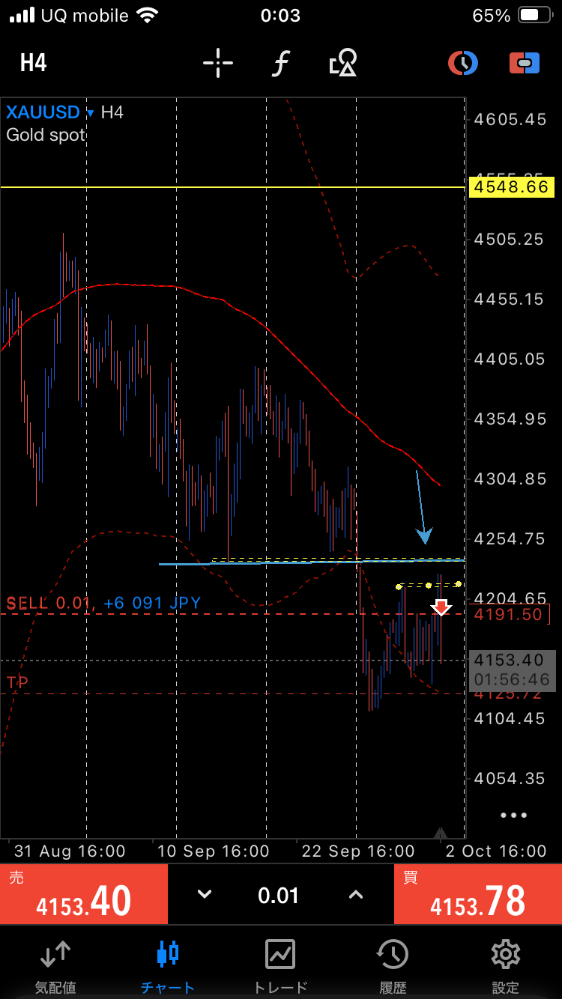
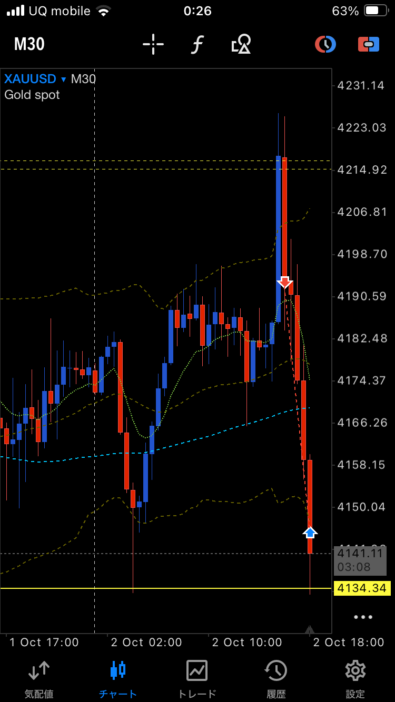
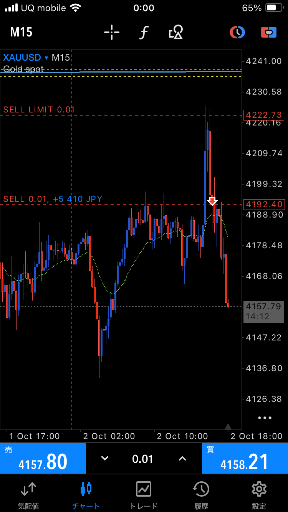
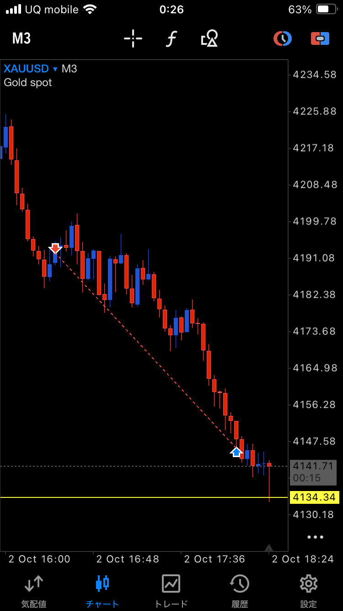

# 2026-10-02 日本株デイトレード議事録

## キオクシアHD｜285A

### 一度目の撤退報告

- 一度ポジションから撤退したとの報告。
- 損失は約7,000円との本人の概算。約定履歴では未確認。
- エントリー・撤退の時刻、価格、数量、撤退理由は未報告。

### 9:37のサポート観察

- 9:37にサポートを認識したとの発言。
- サポートの具体的な価格と、その後の説明は未完了。

### 再エントリー｜3回目のトライ

- 本人が「ロングエントリー中」「3回目のトライ」と報告。
- 許容するロスカット額：7,500円。実際の確定損失ではない。
- エントリー価格の音声文字起こし：「1万880、40」。正確な価格は要確認。
- 数量・損切り価格・利確目標は未報告。
- 3回目の大きな出来高を伴う上昇について、「これでブレイクしたかな」と判断。ブレイクは本人の見立てであり、確定の報告ではない。
- 「3回目のトライ」と「3回目の出来高を伴う上昇」の両方の発言を記録。各回の対応関係は未確認。

### 15秒足｜期待した続伸が出ない

- 大きな出来高を伴う陽線の後、もう一段上昇するプライスアクションを想定していた。
- しかし、その後「上がっていかない」「上がらない」と観察。
- この再エントリー後の撤退・利確・確定損益は当初未報告。その後、10:15にキオクシアをロスカットしたとの報告あり（末尾の追記）。

### その後の観察

- キオクシアが「だらだら上がっていっている」と報告。
- 先の「上がらない」という観察から、その後は緩やかに上昇する動きへ変化したとの実況。
- この発言時点では、新たな約定・手仕舞い・確定損益の報告はない。
- 後続の説明でキオクシアを明示。上昇ロング目線で見ていたところ、揉み合いながらチャネルでじりじり上昇し、19,060円まで上がったと報告。
- 19,060円は到達価格の報告。本人の利確価格としては扱わない。

### 売りエントリー後、即撤退・ロスカット

- キオクシアで18,985円から売りエントリーしたと報告。
- 根拠は、サポートのネック部分を抜ける展開をイメージしたこと。ネックの下抜けが確定済みだったとは明言されていない。
- その後、陰線が一気に陽線へ変わり、大きく買われ、19,025円まで上昇したと観察。
- すぐに撤退・ロスカットしたと報告。
- 19,025円は上昇先の価格の報告であり、実際の損切り約定価格とは断定しない。
- エントリー・撤退の正確な時刻、対象時間足、数量、撤退価格、確定損失額は未報告。

## 日経平均｜上目線と上ヒゲの観察

- 日経平均を上方向で見ていたと説明。
- 一方、日経平均単体では上ヒゲが連発していると観察。
- 対象時間足、各足の時刻・確定状態は未報告。上ヒゲの連発をもって下方向への転換が確定したとは説明していない。

## 任天堂｜7974

- 下落してきた中で、7,860円に買い支えのプライスアクションがあると認識。
- 根拠として「2万株の買いが入っている」と説明。
- 当初、この価格帯で買いたいと検討。この発言の時点では実際に買ったという報告ではなかった。
- 観察した時間足・時刻、注文数量、損切り条件は未報告。
- 2万株の買いは本人の報告であり、助手が板・約定データで確認したものではない。
- 続く実況で、7,860円の買い支えが何回あったのかを再確認する発言。
- 当初、回数の文字起こしが「122回」で不明瞭だったため未確定としていた。その後の説明で、本人が1回目の買い支え・買いと、2回目の買いを明示。少なくとも2回の買いを観察したと更新。

### その後のロングエントリー報告

- 「3ロットがマックスか」と、上限数量を検討する発言。
- 続いて「ロングエントリーをしました」と、実際のエントリーを報告。
- この時点では銘柄名の再提示はなかったが、後続の説明で本人が任天堂（7974）のペナント内でロングしたと明示。任天堂のトレードとして記録。
- 「3ロット」は検討中の上限であり、実際に3ロット約定したとは断定しない。
- 実際のエントリー価格・数量・時刻、損切り価格は未報告。7,860円は観察した買い支え水準であり、約定価格としては扱わない。

### エントリー後の値動きと銘柄の訂正

- 「上の伸びが弱い感じで止まっていて。その中でどうするか」と、対応を検討する発言。
- 助手がフジクラの話と仮置きしたが、本人が「任天堂の話です」と明確に訂正。伸びが弱く止まっているという観察の対象は任天堂として記録する。
- 続いて「任天堂上」と、上方向の動きを報告。具体的な到達価格や上昇の強さは未報告。
- この時点で追加購入、利確、撤退の報告はない。
- フジクラの出来高の補足に続いて「任天堂も上がっている」と、任天堂の上昇を改めて報告。到達価格、追加購入・手仕舞い、損益は未報告。

### 買い支えとペナント内ロングの補足

- 本人が「これ定番じゃん」と、今回の動きを定番のパターンとして認識。
- 任天堂（7974）を明示し、1回目の買い支え・買いに続き、2回目の買いがあったと説明。
- 「2万株」を繰り返し発言。買い支えの量についての補足として記録するが、各回と2万株の対応関係は明言されていないため、合計株数を算出しない。
- ペナントになっていたため、ペナントの中でロングエントリーしたと説明。
- その後、上方向へ進んだと報告。
- エントリー根拠は買い支えの観察とペナント形状。ペナントの上抜けを確認した後のエントリーという説明ではない。
- 先のロング報告を補足する説明として記録。今回の説明だけで別の新規エントリーや追加購入があったとは扱わない。
- 正確な約定価格・数量、利確・撤退、確定損益は未報告。
- 続いて「任天堂ここがチェックかな」と発言。任天堂の監視ポイントとして記録するが、具体的な価格・時刻、何を確認する位置なのかは未指定。利確・撤退・追加購入の実行報告ではない。
- 監視位置について「切り番」と補足。具体的な切り番の価格は未報告。

### 10:01の陽線｜出来高の小ささ

- 任天堂で10:01に発生した陽線について、「ここまで大きく買われない」「小さいボリュームの陽線」と説明。
- 出来高の小さい陽線という本人の観察として記録。ローソク足の実体が小さいという説明とは区別する。
- 時間足・具体的な出来高・価格・足の確定状態は未報告。時刻は発言で示された10:01を採用。
- この足を受けた利確、撤退、追加購入の報告はない。

### 任天堂の読みについての振り返り

- 本人が「任天堂セルインしてたら負けたね、これは読めてよかった」と評価。
- 売りエントリーをしていた場合の仮定の振り返りとして記録。任天堂で実際にショートし、損失を確定したという報告ではない。
- 任天堂の読みが合っていたことを良かった判断として本人が評価。ロングの利確・確定損益は未報告。

### 7,899円の監視水準

- 本人が「7,899円、任天堂、ここに切り板」と発言し、続いて「抜けたらセルインしたい」と売りを検討。
- 本人が示した価格は7,899円のまま記録。「切り板」は切り番の趣旨とみられるが、7,900円へ丸めない。
- 抜ける方向は今回の発言で明示されていない。実際の売りエントリーの報告ではない。

### 7,900円下抜け後｜追いかけ売りを保留

- その後、任天堂が7,900円を割れて下方向へ進んだと報告。
- 7,887円でいったん止まっていると観察。
- 追いかけて売りエントリーはできないと判断し、保留する意向。
- この場面で実際に新規売りをしたという報告はない。先のロングの手仕舞い状況も未報告。
- 続いて、売りエントリーができない状態で、リスクリワードが悪いのではないかと判断。直前の任天堂の追いかけ売り検討に続く発言として記録。
- 同時に「下手くそかな、本当に」と自己評価。これは本人のその場の感想であり、トレード技量の客観的な結論としては扱わない。

## 太陽誘電｜6976

- 下方向にブレイクしたと報告。
- 価格の音声文字起こし：「96089」。正確な価格は要確認。
- 当初「切り板付近ではない」と発言したが、その後、9,700円の切り番があると認識を訂正。
- 最新の説明では、9,700円の切り番付近で下方向へブレイクし、サポートを割れていると観察。
- ブレイク水準は9,700円と補足されたが、先の不明瞭な音声「96089」が示す価格そのものは未確定。
- 時間足、足の確定状態、売買の実行は未報告。

### その後のロング検討条件

- 直前の太陽誘電の話に続くシナリオとして記録。今回の発言では銘柄名の再提示はない。
- サポート割れ後、一度上方向へ抜け、大きな陽線が出た後に戻し・押しがあればロングを検討したいとの意向。
- だらだら下がる展開なら、ロングエントリーはできないという判断。
- 上方向へのブレイク、大きな陽線、押しの発生は、ここでは待ちたい条件の説明。すべてが実際に発生したという報告ではない。
- 実際のロング約定、エントリー価格、損切り条件は未報告。

### ロング機会についての振り返り

- 本人が「太陽誘電もこれロングエントリーできたでしょ」と、ロングの機会があったのではないかと振り返った。
- 実際にロングしたという報告ではない。具体的な時刻・価格・エントリー条件は未報告。
- 続く原発言：「太陽誘電、空口20分...のところを背にロングエントリーできたかなー」。
- ある水準を背にロングできたのではないか、という振り返りとして記録。「空口20分」の文字起こしは不明瞭で、水準名・時刻・時間足のいずれかは確定できないため、原文を残す。

## フジクラ｜5803

- 大きな売りが発生していると観察し、その意味を質問。
- 当初「五千六百」と発言。その後「ただの5600の切り板」と補足し、5,600円の切り番の話と判明。
- 大きな売りが板の売り注文なのか、実際の約定なのか、出来高・デルタ表示なのかは未報告。
- 当初の観察では、売り発生後の価格反応、時間足、売買の実行は未報告だった。
- 本人も「下方向とは言い切れない」と説明。
- 続いて「2回目のトライがあると思います」と予想。直前のフジクラの話に続く見立てとして記録するが、トライの方向・対象水準・時間足は明示されていない。
- 2回目のトライが実際に発生したという報告や、新たなエントリーの報告ではない。
- 任天堂の銘柄訂正を挟んだ後、本人が「上がるかな、フジクラ逆に」と、フジクラの上昇可能性を再検討。実際の上昇や約定の報告ではない。
- 続いて「まだ上方向かな」と、上方向の見立てを継続する発言。断定ではなく本人の見立てとして記録。

### 出来高の補足

- 本人が銘柄をフジクラと明示し、「95万株、26万株と58万株の出来高」と報告。
- 報告された数値：950,000株、260,000株、580,000株。
- 出来高として記録。各数値を売りだけの株数、買いだけの株数、デルタ出来高と断定しない。
- 対象時間足、各足の時刻・陽線陰線・確定状態、値動きとの対応関係は未報告。独立した数値か累積値かも未確認のため、合算しない。

### 売りエントリー｜下抜けブレイクへの飛び乗り

- 本人が「フジクラ、セルアインしました」と、売りエントリーの実行を報告。
- 根拠は、大きな出来高を伴う足の部分を下に抜けたこと。
- 足について「陽線、陰線」と発言。後の語は陰線だが、言い直しか両方の足を指すかは未確定。
- 本人が「下に抜けてからのブレイク飛び乗りのセルアイン」と説明。下抜けに飛び乗った売りとして記録。
- 後続の説明でフジクラ（5803）と9:52の起点を明示。9:52はきっかけとなった値動きの時刻であり、約定時刻とは断定しない。
- 本人は、その場面で「みんなセルインをしている」と認識。これは他の参加者についての本人の見立てであり、独立確認した事実ではない。
- クラスターレンジをブレイクした後に戻しが入り、レジサポの下限から売ったと補足。初報の「ブレイク飛び乗り」と、後続の戻しについての説明を両方残す。
- 売りエントリー価格として5,575円を報告。
- その後「強い」と発言。強いと感じた方向や具体的な値動きの説明は未完了。
- 当初「5,592円を割らない限り」と発言したが、続いて「上に抜けない限りセルイン継続」と訂正。売り継続の条件は、5,592円を上抜けないこととして記録。
- 5,592円は本人が示した継続判断の水準。実際に逆指値を設定したという報告はない。
- 数量・正確な約定時刻・対象時間足・利確目標は未報告。
- 先の5,600円や95万株・26万株・58万株と対象足との対応関係は明示されていない。
- このエントリー報告の時点では、手仕舞い・確定損益は未報告だった。

### 5,581円・5,586円付近の観察

- フジクラが5,581円をレジサポにしていると認識し、「ここを抜けない限り」と条件を検討。
- 続いて「抜けたかな」と発言。抜けたことを確定した報告ではない。
- 次の押し目候補として5,586円付近を挙げ、他の参加者もそこを見ているのではないかと考えた。
- 「買われたな」と観察。
- これらの水準を、約定価格や実際に設定した逆指値の価格とは扱わない。

### ロスカット｜買いの歩み値を見て撤退

- 本人が、フジクラで売りエントリーしたポジションをロスカットしたと明確に報告。
- 大きな出来高を伴う買いの歩み値を見て「やばい」と感じ、ロスカットしたと説明。
- 数値は当初「1万5000円」と文字起こしされたが、続いて「一万五千株だったかの買い」と株数の話として補足。その後「一万七千の歩み値があった」と説明。
- 買いの株数は約15,000株または17,000という報告を、数量要確認として残す。15,000円や17,000円を損失額としては扱わない。
- 実際の撤退価格・時刻、保有数量、確定損失額は未報告。
- その後「フジクラは結局上方向かな」と、上方向の可能性を再検討。新たなロング約定の報告ではない。

### 助手による条件付きの読み方

- 大きな売りの表示だけでは、売り優勢や下落継続とは断定できない。
- 実際に売り約定が多くても価格が下がらない場合は、買いが売りを受け止めている可能性がある。ただし、これだけで上昇確定ではない。
- 売り後に安値を更新し、戻しても元の水準を回復できない場合は、下方向の圧力が強まっている可能性を考える。
- 板上の売り注文と実際の売り約定は区別する。
- 上への再トライを評価する条件として、売りが出た後も下がらないか、直近高値を更新できるかを見る。高値更新に失敗し押し安値を割る場合は、上昇シナリオが弱まる可能性を考える。現在の価格反応を助手が確認したものではない。
- 制度の参照：[日本取引所グループ｜売買成立の方法](https://www.jpx.co.jp/equities/trading/domestic/04.html)。上記の価格反応の読み方は一般的な条件付きの解釈であり、フジクラの現状をデータで確認した結論ではない。

## 直近の発言の文字起こし

以下は、受け取った会話の文字起こしにある本人の発言。音声認識で不明瞭な箇所も、原文のまま残す。

> セルインができない状態かなー、ちょっとリスクリワードが悪いかなしても下手くそかな、本当に

> いやー、太陽誘電もこれロングエントリーできたでしょ

> 太陽誘電、空口20分...のところを背にロングエントリーできたかなー

> そのまま議事録として整理して録音、文字起こしして、保存してくれればOKです

> ん

> 文字起こしをして、今喋っていることを

> いやー、サポートされたか

この「サポートされたか」は、対象銘柄・価格・時間足が未指定の観察。サポート成立を断定した発言ではない。

> うーん...ん...キオクシアはセルインしたけどロスカット。えーと、サポートのネックのところを抜けるという感じをイメージして、1万8,985でセルインしましたが、えーと、陰線が一気に陽線に変わって、大きく変われて、1万9,025まで上がっていきましたすぐに撤退...ロスカットしました

## 記録上の扱い

- 本人の実況を整理した記録。相場・約定データの独立確認はしていない。
- コンピューターの約定アラートは除外し、本人が説明した売買・観察を採用。
- 約7,000円の撤退損失と、再エントリーの許容損失7,500円を分けて記録。
- 過去の日誌や画像の内容は、本日分の事実として転記していない。
- 本人の希望により、実況の反復を控えて議事録として保存。
- 最新の希望：実況中は発言を反復せず、応答は「はい」のみ。記録を保存し、最後に依頼された時にMarkdownを出力する。
- 本人が、発言を議事録として整理し、文字起こしして保存する運用でよいと再確認。
- 本人が「今喋っていること」の文字起こしを依頼。直近の発言は整理した議事録に加え、原文も保存。

## 10:15｜キオクシアのロスカットと本日の損益（追記）

- 10:15にキオクシア（285A）をロスカットしたと報告。
- 本日の損益は「3万円くらいマイナス」との本人概算。
- 「最悪」との所感。
- 3万円は本日の概算として記録。個別取引ごとの内訳、約定履歴による確定損益は未確認。

## キオクシア｜下げ止まり出来高からのロングと建値撤退

- 下げ止まりを示す出来高を根拠にロングエントリー。
- 下降ダウの分岐点に合流するあたりまでの上昇を想定したが、そこまで届かずに下落。
- その後、安値を切り上げて再度上昇を試す動きがあった。
- 安値切り上げ後にもう一度ロングできたかは判断が難しく、振り返りの課題として残す。
- ポジションは建値で撤退したと報告。手数料などを含む確定損益は未確認。

## 日経平均｜強い上方向とレンジ推移

- 日経平均は強い上方向と認識。
- 直近はレンジ内で推移していると観察。
- 添付チャートを参考資料として共有。具体的なレンジ上限・下限やブレイク方向の確定は、今回の発言では未指定。

## 本日のトレード振り返り｜エントリー判断と反省

### フジクラ｜出来高を伴う陰線からの売りとロスカット

- 大きな出来高を伴う「K1」の位置で大陰線が発生したことを根拠に、セルイン。
- その後、上下に注文がぶつかるクラスターレンジのような動きとなった。いったん上抜けして参加者のロスカットを巻き込んだ後、下がる展開を想定し、保有していた売りを一度手仕舞った。
- 値幅が大きく、最初の売りは大きなロスカットになった。
- その後、大陰線が発生した位置のサポートネックラインを下抜けたところで再度セルイン。しかし、陽線で半値ほど戻されたためロスカット。
- 反省点は、どのような出来高とプライスアクションを確認してから売るべきだったか。出来高を伴わない陰線を想定していたのか、レジスタンスに当たってから出来高を伴う陰線が出る形を待つべきだったのか、条件が曖昧だった。
- 出来高だけで判断せず、戻りの位置や売り後の価格反応を含め、エントリー条件を整理する課題が残った。

### ソフトバンクG｜飛び乗りロングと遅れた損切り

- 最初のロングエントリーは失敗だったと振り返り。上昇に飛び乗った形になった。
- 日経平均が上方向で、レンジから再上昇するイメージを持っていた。一方、62EMAは横向きで、相場はレンジと認識できる状態だった。
- レンジ相場なら下限からのロングを待つべきだったが、上に上がれず戻ってきた動きを見てエントリーした。
- ピンバーを伴って戻された後も損切りが遅れ、価格が大きく下がってからロスカット。含み損を広げてしまった。
- 今後の課題は、レンジ認識とエントリー位置を一致させ、レンジ上部への飛び乗りを避けること。

### キオクシア｜ロング後の再エントリー判断と売りの失敗

- 前日の成功例に引っ張られ、十分な確認をせずロングしてしまった可能性があると振り返り。
- 価格が下落し、終値または主要サポートラインを割った後、15秒足で下げ止まりに見える陰線の買い戻しピンバーが発生。続いて、押し目のダウが確認された後にロングエントリーした。エントリーはやや遅れた。
- 上昇してダウの分岐点付近まで到達したが、目標にわずかに届かず、急な陰線で戻されたため縦値で手仕舞い。
- その後は安値を切り上げて下げ止まっていたため、再度ロングできた可能性があるが、迷っている間に上昇し、再エントリーを逃した。
- 高値からダウの分岐点にタッチしたところでセルインしたが、価格は下がらず、その後は陽線を伴ってチャネル状に上昇。売りは失敗だったと振り返り。
- さらに、19,000円の切り番付近でもみ合った後、ヘッドアンドショルダーのネックラインを下抜けたところでセルインしたが、戻されてマイナスとなった。
- 下げ止まり後の安値切り上げを見た再ロングの条件と、分岐点タッチやネックライン下抜け後に売りが続くかを判断する条件が課題。

### 任天堂｜ダブルボトムからのロング候補

- 下値でピンバーが発生し、ダブルボトムを形成。2回目の安値タッチだったため、反発を判断する根拠の確認が必要な場面だった。
- 15秒足で大きな出来高を伴う下げ止まりのサインがあり、高値切り下げのトレンドラインを上抜ける形も見られたため、ここはロング候補だったと振り返り。
- ダウの分岐点まで約36ティックの値幅があり、3ロットなら約9,000円の利益を狙えた可能性がある。これは実際の損益ではなく、振り返り上の試算。
- 本人の評価として、エントリーポイントの一つだった。

### 太陽誘電｜出来高を伴うピンバーからのロング候補

- サポートを割った後、大きな出来高を伴うピンバーが発生していた。
- この下げ止まりのサインを根拠に、ロングエントリーを検討できた場面だったと振り返り。
- 実際にエントリーしたという報告ではなく、候補として記録。

### 今日の振り返りメモ

- 出来高の大きさだけでなく、発生した位置、直後に価格が伸びたか、戻されたかを合わせて判断する。
- レンジと認識している場合は、レンジ下限など位置を選んでエントリーする。
- 前日の成功体験をそのまま当てはめず、当日の下げ止まりやダウの形を確認する。
- 再エントリーを迷った場面について、安値切り上げ後に何を確認できれば再ロングするのか、条件を言語化する。

## 太陽誘電｜15秒足の下げ止まりからのロング振り返り

### 下落局面と出来高

- 15秒足で確認。9:21頃、前日の上昇から一転して大きく下落し、陰線が続く展開を観察。
- VWAPも下向きだったとの認識（音声文字起こしは「デブアップ」）。
- Relative Volumeで、9:06に出来高を伴う陰線が発生し、小さなクラスターレンジの下限を下抜けたと記録。発言では9:21の下落と9:06の出来高足の順序が前後しているため、時刻は要確認。
- 9,800円の切り番付近で下げ止まりに見えるピンバーが出たが、切り番であるためまずは様子を見た。
- その後も下落し、9,745円まで到達。9,785円付近でレジサポ反応があった後、さらに下方向へ進んだと観察。
- 9,700円付近で大きく買い戻されたピンバーを確認。15秒足で約146,500株の出来高があったとの報告。
- 9,700円を一度下抜けて9,680円まで振られた後、大きな出来高を伴う陽線のピンバーが発生。ここで初めてロングを検討できるサインが出たと判断。
- 9,700円付近で約14万株、続いて約7万株の出来高があったとの追加説明。各出来高の足や正確な対応関係は要確認。

### ロングと利確候補

- 下げ止まりのサインを受けてロングエントリーを実施したと報告。
- 当初は9,710円付近を狙っていたが、価格は9,735円まで上昇したとの説明。
- 後の発言では「9,816円で」とエントリー水準を示したが、先に報告された9,710〜9,735円と整合しないため、約定価格は要確認として保留。
- 9,747円を上抜けたことから、下降トレンド継続を前提に早く手仕舞うより、もう少し上を期待して保有する案を検討。
- ダウの分岐点は9,782円との認識。上昇が続くかを判断する目安として意識した。
- 利確候補は、出来高を伴ったレンジ帯の上限、およびVWAP付近の9,859円と考えた。これは利確候補であり、実際の約定価格・確定利益ではない。
- トレード時間は9:21のロングから9:24の利確まで約3分との振り返り。実際の利確価格は未確認。
- 9,816円、9,710〜9,735円、9,859円について発言間に不整合があるため、約定履歴での確認が必要。

### 振り返り

- 9,800円の切り番だけで早期に判断せず、その後の下抜け、9,700円付近の大きな出来高、9,680円への振り落とし後の買い戻しピンバーを確認してからロングを検討した。
- 下げ止まりの判断では、切り番へのタッチだけでなく、大きな売買の後に安値を更新できないことや、陽線で買い戻される反応を合わせて見る。
- 利確候補として、ダウの分岐点9,782円と、出来高レンジ上限・VWAP付近の9,859円を意識した。
- 約定価格と実際の利確価格は、音声記録だけでは確定できない。
## 追加の振り返り｜太陽誘電・村田製作所・フジクラ・任天堂

### 太陽誘電｜9,700円付近の大出来高からロング

- 9,800円の切り番を下抜け、9,700円付近で大きな出来高を伴う買いが発生した場面を、ロング候補として振り返った。
- 9,700円付近の買いを背にロングエントリーできたポイントがあったとの認識。
- 日経平均がロング優位・上方向だったことも、ロング判断の根拠の一つとして考えた。
- エントリー価格・実際の損益は、先の太陽誘電の記録にある価格の不一致を含め、約定履歴で要確認。

### 村田製作所｜高値ブレイク後の下落と戻し

- 本日の高値付近を一度上抜けた後、上げ止まり、下方向へ進んで本日の安値を更新したと観察。
- その後は反値戻しのように、チャネルを形成しながら戻しているとの見立て。
- 具体的な価格・時間足、売買の実行は今回の発言では未報告。

### フジクラ｜切り番付近の売り飛び乗りと踏み上げ

- 5,600円の切り番付近で約58万株の大きな売りが出たと観察し、その動きに飛び乗ってセルイン。
- 5,600円付近でクラスターレンジとなり、その後5,620円付近まで上に振れた。売り方のロスカットを巻き込んでから反落する形を想定していた。
- その後、緑色のレシオ系指標が上向くような場面で、大きな出来高を伴う陰線が発生。サポートと思われる位置から再度セルインしたが、約23ティック逆行し、さらに高値を更新された。
- 結果として5,600円の切り番を上抜けて上昇した。
- 10:40ごろにも約28万株の陰線が出たが、その売りを吸収するように買われ、さらに上昇。最後に約51万株の陽線が出て、本人は天井の可能性を考えたが、確定ではない。
- 5,700円の切り番も意識されていた。複数の切り番付近で振られやすく、フジクラは苦手意識があると振り返った。
- 売り出来高の大きさだけで飛び乗らず、切り番周辺のレンジ形成、上への振り、買い戻し後に下落が続くかを確認することが課題。

### 任天堂｜7,862円付近の買い支えからロング候補

- 9:25ごろ、陽線から陰線へ転じ、切り番を割れて下落。その後チャネル状となり、高値を切り下げながらフラットボトム付近で支えられていたと観察。
- 発言では「4,900円の切り番」と聞こえるが、任天堂の価格帯と整合しないため、価格は要確認（7,900円の聞き違いの可能性）。
- 9:31:30ごろに約22万株の出来高があり、7,862円付近では同値で約2万株を伴うピンバーが出たとの報告。これを根拠にロングできる場面と考えた。
- 実際に7,869円付近で3ロットのロングをエントリーしたと報告。その後、フジクラの値動きに乗り換えた。
- 任天堂を保有し続けていれば、ダウの分岐点7,900円付近まで伸ばせた可能性があると振り返った。約33〜37ティック、3ロットで約9,900円という金額は本人の試算で、実現損益ではない。
- 「15分足」と発言した9:56:30ごろに大きな陰線が発生した後、7,900円付近で支えられて次に上がる形を想定。足種は15秒足の可能性もあり、要確認。
- 任天堂のロング候補を保有し続ける条件と、他銘柄へ乗り換える判断が振り返りのポイント。

## トレード後チェックリスト

- [2026-10-02 トレード後 TodoListForm](2026-10-02_post_trade_todolist.md)

## 午後の追記｜ソフトバンクG（9984）

### ロング判断と根拠

- 14:38時点の実況で、6,339円の切り番と下げ止まりの可能性を見てロングしたと報告。実況時刻と実際の約定時刻は区別し、約定時刻は未確認として扱う。
- 2分足で一目均衡表の遅行線に触れ、レンジ下限に近いと感じたことを根拠の一つにした。
- 6,300円付近では複数回買いが入ったが、価格は6,300円から6,270円付近まで押し戻された。
- 14:27:45に64万株の大きな買いがあったと観察し、この価格帯に買い支えがあると考えた。
- 一方で、6,300円を割っていたため、全体としては下方向の見立てが残る中での逆行ロングだった。
- 5分足は上にも下にも進みにくく、5分間でおおむね6,300円から6,284円の範囲にとどまったとの観察。
- 日足はヒゲのない強い陰線に見え、もう一段下げる可能性も考えていた。
- 出来高の観察として「1,333M」と発言。指標の意味は未確認。6,251円付近では約100万株の売買、6,287円付近では約150万株の買いがあったとの報告。

### ロスカットと売りへの訂正

- ロングは6,271円で3ロットをロスカットしたと報告。6,339円のエントリー値との差は68円。
- その直後、6,271円で3ロットをセルインしたとの発言があったが、本人が「やっぱ違う」と訂正。売りの新規約定は未確認として、確定取引には含めない。

### 15:00時点の振り返り

- ロスカット後、株価は6,295円まで戻ったと報告。
- 6,250円付近では大きな買いが入り、出来高を伴う陰線のピンバーで下げ止まったように見えた。その後は、想定していた下落ではなく、じりじり上昇した。
- 6,271円や6,250円付近で損切りが出てポジションが軽くなり、上昇しやすくなった可能性を考えた。ただし、他の参加者の損切り状況は確認できておらず、本人の仮説として記録。
- 安値同士を結んだ下降チャネルは引き方が強引だったと振り返った。斜めのチャネルを前提にせず、6,300円・6,271円・6,250円などの水平水準と、下げ止まり後のダウの転換確認を重視したいとの考え。
- 6,260円付近で買う案にも触れたが、実際の追加エントリーではなく、下げ止まりやもう一つのダウの分岐点を待つべきか迷っていた。

### 相場環境と次回の確認点

- アドバンテストは10時時点で上げ止まり・レンジの可能性を感じたが、まだ確定ではないとの見立て。
- ソフトバンクGはダウの分岐点を下抜けており、振り返りでは全体を下降トレンドと判断。下げ止まり候補の買いだけで逆行ロングを決めず、上位足の方向と反転確認を待つことが課題。
- 6,250円付近の大出来高は下げ止まり候補として記録し、反転確定とは区別する。

## 追加振り返り｜キオクシア・フジクラ・ソフトバンクG

### キオクシアの値幅

- 下から上まで、上限・下限の間に15,500円程度の値幅があったとの振り返り。
- この値幅を取っていけるようなパターンだったと認識。
- 数値は本人の発言に基づく記録であり、チャート上の正確な値幅は要確認。

### 銘柄ごとのボラティリティと反省

- フジクラ（5803）はボラティリティが低いと感じた。エントリー後に上下してもよいのではないか、という見方。
- ソフトバンクG（9984）はボラティリティが高かったが、本日はうまく対応できず、失敗したとの振り返り。

## FX Gold（XAUUSD）｜下降ダウの戻し上昇からショート

### 相場認識とエントリー

- 4時間足は下降基調。Wトップのような形になり、戻しの上昇が直近高値を更新できなかった。
- 下降ダウの戻しによる上昇が止まり、再び下方向へ向かう動きを想定してショート。
- 約定履歴では、2026年10月2日 16:28:04に **4,192.40で0.01ロットの売り**。

### 決済と結果

| 項目 | 内容 |
|---|---:|
| エントリー | 4,192.40（売り 0.01ロット） |
| 決済 | 4,146.04（2026-10-02 18:07:16） |
| 値幅 | 46.36 |
| 画面表示の損益 | +7,315円 |
| 手数料欄 | -9円 |
| 履歴画面に表示されたSL / TP | 4,191.50 / 4,125.72 |

- 当日最安値までの下落を利確目標として見ていた。履歴上の決済価格は4,146.04。
- 画面表示では、価格変化は約1.11%。損益と手数料は履歴画面の表示値を記録。
- SLの4,191.50は売りのエントリー価格より下に表示されている。初期設定か、取引中に変更した値かは未確認。
- TPの表示価格4,125.72より手前の4,146.04で決済している。決済の具体的な操作理由は未記録。

### 振り返り

- 4時間足の下降構造と高値更新失敗を上位足の根拠にし、戻しの上昇を追いかけずに売り場を待てた。
- その後は短期足でも下落が続き、当日安値圏までの値動きを捉えて利確できた。
- 次回は、上位足のWトップ候補に加え、戻りの終了を短期足でどう確認したか、また当日安値と設定TPのどちらを優先するかを記録する。

### チャート記録

