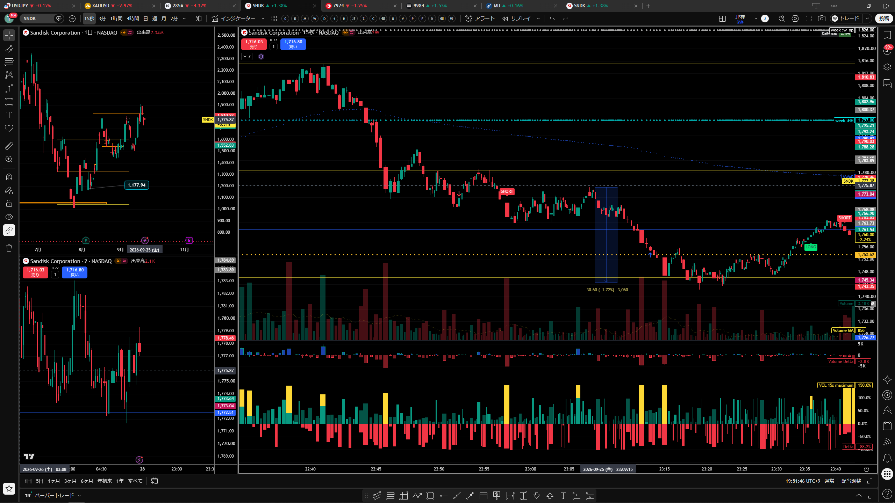
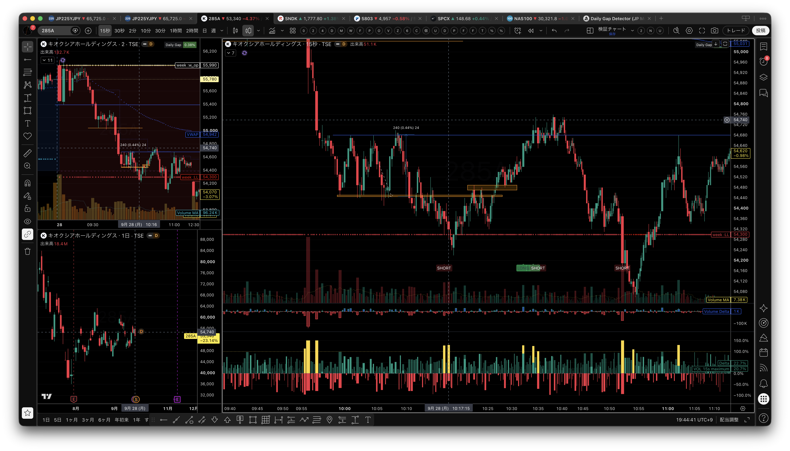
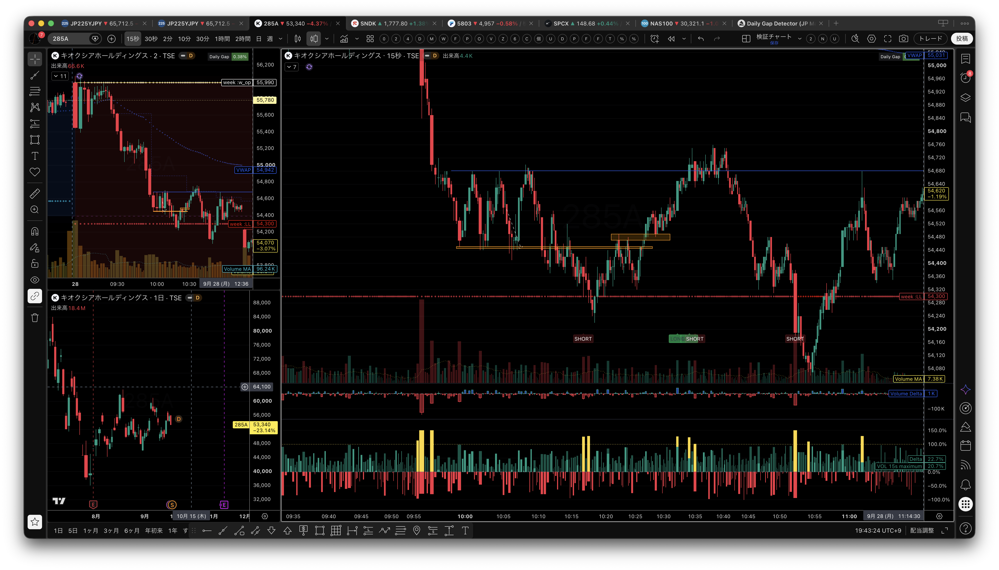
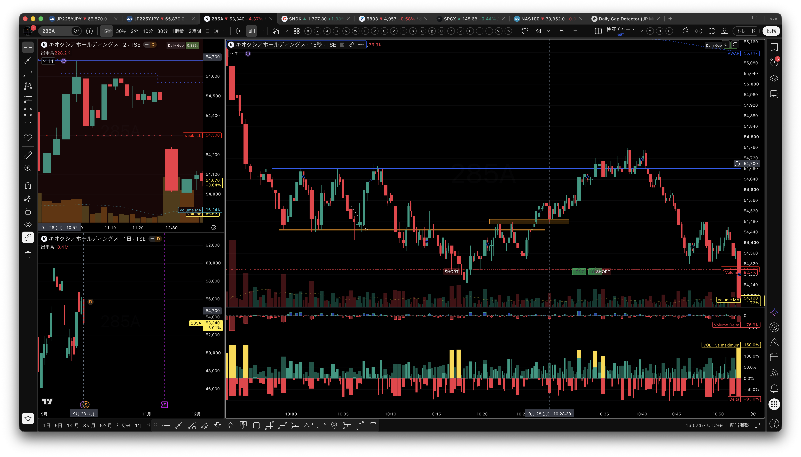
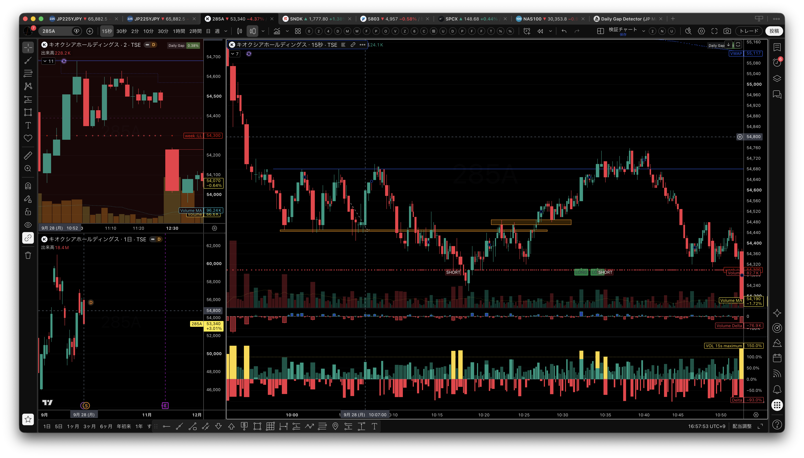
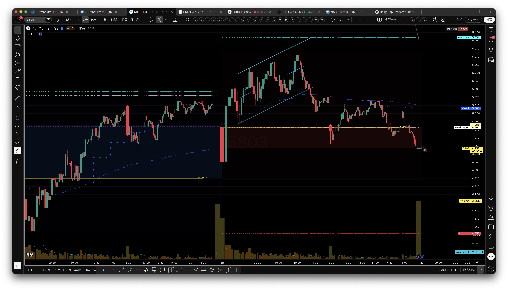
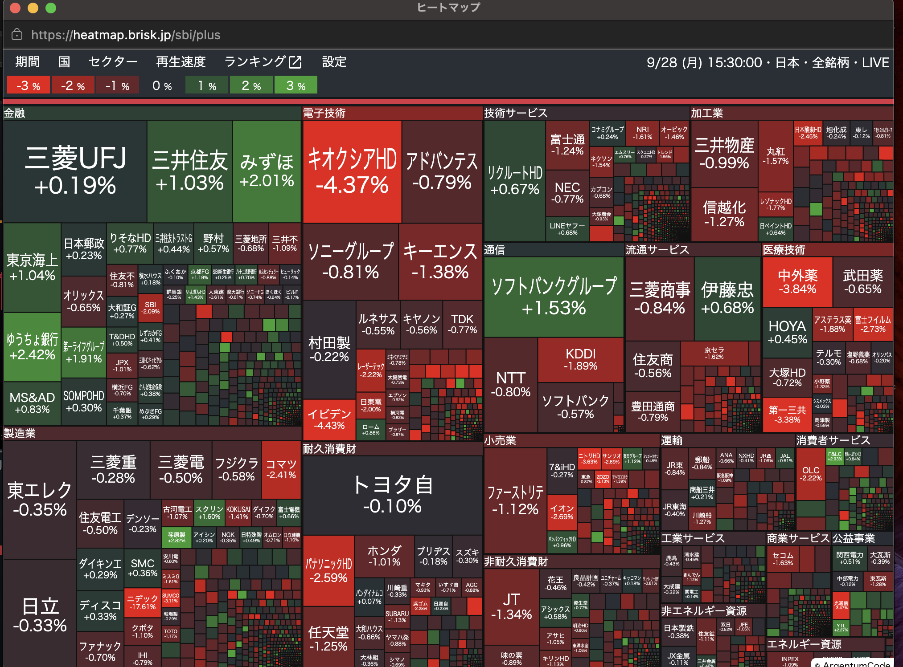
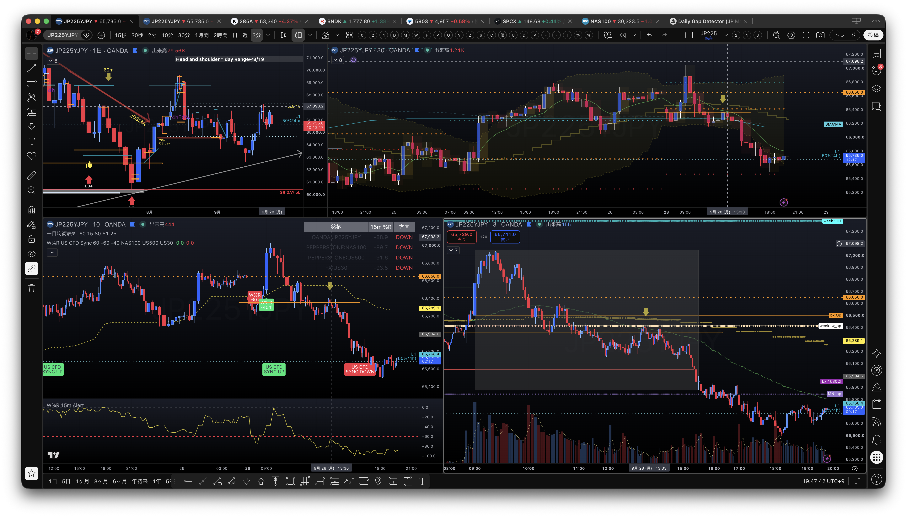
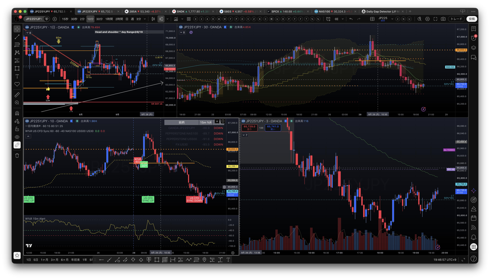
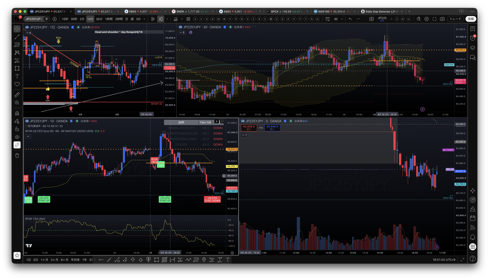

# 2026年9月28日（月）本番トレード日誌｜松井証券ノートレード・JP225下方向の検証

## 記録の位置づけ

本日は、JP225（日経225 CFD）を中心に、日経平均のパーセントR、CFDの方向、15秒足・2分足の値動きを見ながら、下げ止まりと反転のエントリーポイントを検証した。フジクラ5803、キオクシア285A、SANDISKの画像も補助資料として保存した。

この日誌では、本人がチャートで観察した内容、エントリー候補、仮の損切り条件を、実際の口座記録と分けて記録する。**本日は松井証券口座でのトレードはなく、松井証券の注文・約定・実現損益は発生していない。**一方、指定された0928demoフォルダには別系統の紙上取引CSVがあるため、松井証券の本番実績とは混同しない。

> **本日の口座ステータス：松井証券口座はノートレード。**
>
> 本番の確定損益は「0円」と断定するのではなく、**取引なし・損益計上なし**として記録する。チャート上のロング候補や240ティックの値幅は、すべて検証上の仮説であり、実績には含めない。

## 0. 本日の結論

序盤は、下げ止まりを確認してから試しのエントリーを狙っていたが、明確なエントリーポイントがなく、無理に入らず見送った。その後、JP225は55,430円付近の安値を更新してブレイクし、55,080円付近でレンジを作ったあと、9時54分頃に再び下方向へ進んだ。

11時5分頃には、15秒足で出来高のダイバージェンスが見え、反発の可能性を考えたが、ここではエントリーできなかった。下降トレンド中の戻り高値から、240ティック程度の値幅を取れた可能性はあるが、これは実績ではなく、後から見たエントリー候補である。

その後も55,450円付近の安値を割る場面があり、日経平均のパーセントRは10時半頃までは上方向だったが、そこからレンジを挟み、午後に最終的に下方向へ転じた。後半にはサポートとレジスタンスの転換からロングを検討できる場面があったが、松井証券口座では実際の注文・約定を行っていない。本日は、上向きからレンジ、午後の下方向への変化を見極める検証日として整理する。

> **本日の一文：** 下方向の環境で反発を狙う場合は、ダイバージェンスだけで入らず、サポレジ転換後の定着、安値切り上げ、VWAP回復、出来高の再増加を確認してから試す。

### 本日の実績ステータス

| 項目 | 結果 |
|---|---|
| 松井証券口座 | トレードなし |
| 本番の注文・約定 | なし |
| 本番の実現損益 | 取引なし・損益計上なし |
| 日誌の中心 | JP225の下方向環境と反発候補の検証 |
| 参考資料 | 0928demoの紙上取引CSV、チャート画像10枚 |

### 本日のレギュラー監視銘柄

| コード | 銘柄 | 本日の日誌上の扱い |
|---|---|---|
| 285A | キオクシアホールディングス | レンジ・下方向の値動きと出来高を観察 |
| 6857 | アドバンテスト | レギュラー監視銘柄として記録。松井証券の本番取引なし |
| 6976 | 太陽誘電 | レギュラー監視銘柄として記録。松井証券の本番取引なし |
| 9984 | ソフトバンクグループ | レギュラー監視銘柄として記録。ストップ高ではなく通常の値動きとして扱う |
| 5803 | フジクラ | 2分足の上昇ライン割れと下方向への傾きを観察 |

※「SOFTBANK」と「5803」は別銘柄として整理した。5803はフジクラ。

## 1. 相場環境

### 日経平均のパーセントR

- 寄り後から10時半頃までは、日経平均のパーセントRが上方向へ向いていた。
- 10時半頃からレンジを挟み、方向感が弱くなった。
- 午後にはパーセントRが最終的に下方向へ向かい、ロングの反発狙いには逆風の環境になった。
- したがって、日中全体を最初から下方向と決めつけず、上向き・レンジ・下向きへの変化を時系列で確認する。
- 個別の陽線や一時的な出来高増加だけで、相場全体が反転したとは扱わない。

### CFDの方向

- CFDのパターンも下方向として確認した。
- 日経平均のパーセントRとCFDが同じ下方向を示す場合、基本シナリオは戻り売り・見送り寄りになる。
- 下方向に乗るかどうかは難しい場面であり、戻り高値、直近安値の更新、リスク幅を確認してから判断する必要がある。

## 2. JP225の値動きと検証

| 時刻・水準 | 本人の観察 | 日誌上の扱い |
|---|---|---|
| 序盤〜10:30頃 | 日経平均の％Rは上方向。明確な試しのエントリーポイントはなく、下げ止まりを待った | 上向きでも即ロングにしない |
| 55,430円付近 | 寄り後の安値を更新してブレイク | 下方向継続の確認候補 |
| 55,080円付近 | いったんレンジを形成 | レンジ内で追いかけない |
| 09:54頃 | レンジ後に下方向へ進んだ | 下落再開の観察 |
| 11:05頃 | 15秒足で出来高のダイバージェンスを確認 | 反発候補。ただし未エントリー |
| 11:18頃 | 安値55,450円を割って下へ付けたとの観察 | 下方向の再確認 |
| 10:28頃／12:25頃 | サポレジ転換からロングを検討したとの記録 | 時刻の記述が混在しており、チャート上の候補として要確認 |
| 10:32頃 | 大きな出来高を伴う陽線が発生 | 上方向の試し。ただし上値追随は未確認 |
| 10:53頃 | 55,000円を割れて一気に下へ抜けたとの観察 | ロング仮説が崩れる候補 |
| 10:30頃以降〜午後 | レンジを挟んだあと、％Rと価格が最終的に下方向へ進み、55,340円付近まで下がったとの観察 | 上向きからレンジ、午後の下方向への変化を確認 |
| 13:27頃 | 日経平均に「ペトラセルのようなパターン」が出たとの観察 | 用語・形状は後で同定する |

### 下方向のトレード候補

11時5分頃の15秒足の出来高ダイバージェンスは、下落の勢いが弱まり、短い反発が出る可能性を示す候補だった。ただし、ダイバージェンスは反転の確定ではない。反発後に戻り高値を超えられず、再び安値を更新するなら、下降トレンド中の戻りとして扱う。

下降トレンド中の戻り高値付近から240ティック程度を取れた可能性は、後知恵の検証値として保存する。実際に取った利益としては記録しない。

### サポレジ転換からのロング候補

下げ切れずに一度上へ戻った局面を、サポートとレジスタンスの転換としてロング候補にした。考え方としては、下方向のブレイクが失敗し、転換後の価格が新しいサポートとして維持されれば、ロングを試す余地がある。

ただし、本人メモには「10時28分頃」と「12時25分頃」の両方が登場している。これらが同じ場面を指すのか、別のロング候補を指すのかは確定していない。実際のエントリー時刻は、チャートまたは注文履歴で再確認する。

### ロスカット条件

- 54,570円を下割れしたらロスカットする案があった。
- 2枚で約1,000円程度という試算があった。
- ロスカット時は約8,000円の値幅・損益になる可能性についても言及があったが、単位・枚数・建値の前提が未確定である。
- 上記はすべて本人の試算・仮説であり、実現損益には含めない。

## 3. 今日の判断と反省

### 良かった点

1. 序盤に明確なエントリーポイントがないと判断し、下げ止まりを待った。
2. 15秒足の出来高ダイバージェンスを、反発候補として認識できた。
3. 日経平均のパーセントRとCFDが下方向にそろったことで、個別の一時的な陽線だけを見て上方向へ決めつけなかった。
4. サポレジ転換からロングを検討する際、54,570円割れという損切り候補を先に考えた。

### 反省点

1. 11時5分頃のダイバージェンスで、反発を狙う場合のエントリー条件を事前に固定できていなかった。
2. サポレジ転換のロング候補について、10時28分頃と12時25分頃の時間記録が混在した。
3. 下降トレンド中の反発と、トレンド転換後の押し目を明確に分ける必要がある。
4. 55,000円割れのような大きな価格変化の前後では、ロングの仮説を維持せず、価格がサポートとして戻るかを再確認する必要がある。
5. 「取れたはずの240ティック」と実際の約定結果を混同しない。約定記録がないものは、検証上の候補として保存する。

## 4. 次回の参戦ゲート

### 下方向に乗る場合

- 日経平均のパーセントRが下向きであることを確認する。
- CFDも下方向で、戻り高値が切り下がっていることを確認する。
- 直近安値の更新後、戻りが弱く、再度下へ向かう形を待つ。
- 直近安値の真下で追いかけず、戻り高値と損切り位置を先に決める。

### 反発ロングを試す場合

- 15秒足の出来高ダイバージェンスだけでは入らない。
- 下げ止まり後の安値切り上げを確認する。
- サポレジ転換後、転換した水準を割らずに維持するかを見る。
- VWAP回復、直近高値更新、出来高の再増加が揃うまで待つ。
- 54,570円割れなど、事前に定めた無効化水準を守る。

## 5. SANDISKの記録外エントリーポイント

- 対象：SANDISK
- 日時：2026年9月25日（金）夜、23:09〜23:14
- 方向：SELL ENTRY POINT
- 記録状態：松井証券の記録には入っていない
- 扱い：本人申告による別記録。松井証券の実約定・実現損益には加算しない。

SANDISKのSELL ENTRY POINTは、本日9月28日のJP225の実績とは分けて管理する。正式な約定時刻、数量、価格、決済の有無が確認できるまでは、トレード候補または本人メモとして保存する。

## 6. 実績記録との区別

| 項目 | 本日の日誌での扱い |
|---|---|
| JP225の価格水準・時刻 | 本人のチャート観察。時系列に一部要確認 |
| ダイバージェンス・サポレジ転換 | エントリー候補・検証仮説 |
| 240ティック | 取れた可能性のある後知恵の検証値。実績ではない |
| 54,570円割れ | ロスカット候補。実際の注文状況は未確認 |
| SANDISK 9/25夜SELL | 松井証券記録外の本人申告。損益未計上 |
| 本日の松井証券確定損益 | トレードなし・損益計上なし |

## 7. 参考資料：0928demoの紙上取引

指定された /Users/th/Library/CloudStorage/OneDrive-個人用/TradeDaily/0928demo には、TradingView等の紙上取引エクスポートが保存されている。これは松井証券口座の記録ではないため、本番日誌の損益には加算しない。

- 9月28日分の注文履歴CSV：10件（約定9件、拒否1件）
- 対象シンボル：285A、6857、6976、7974
- エクスポート時点の紙上ポジション：285Aロング300、SPCXロング6、JP225ショート1
- 紙上取引の残高履歴には9月28日分の記録があるが、松井証券の本番取引とは別管理

## 8. 画像資料（10枚）

画像は日誌の観察根拠として、assets/2026-09-28/screenshots/ にコピーして保存した。画像から読み取った価格や時刻は、約定実績ではなくチャート観察である。

### SANDISK・個別銘柄

2026年9月25日（金）23:09〜23:14のSANDISK SELL ENTRY POINT。松井証券の記録には入っておらず、本日9月28日の本番実績にも含めない。

### キオクシア285A・チャート観察

キオクシア285Aの画像は、55,000円台前半から55,000円割れ方向への値動き、戻りと再下落、出来高の偏りを振り返る補助資料として保存した。画像上のSHORT表示や240の値幅表示は、松井証券の約定を示すものではない。

### フジクラ5803

フジクラ5803は、画像上で5,070円付近から5,000円前後を経て4,957円付近へ下げる流れが見える。VWAP表示は5,006円付近で、後半はVWAP下で推移している。UP CHANNELやN字DOWの検証対象としては、上昇ラインを割った後に再び下方向へ傾いた点を記録する。

### ヒートマップ

15時30分のヒートマップは、金融の一部が緑である一方、電子技術や加工業には赤が多い混在した状態だった。画像上ではキオクシア-4.37%、ソフトバンクグループ+1.53%、村田製作所-0.22%、フジクラ-0.58%などが確認できる。全体を一方向の強い上昇とは扱わない。

### JP225・CFDのマルチタイムフレーム

画像10が、日経平均％Rの今回の時系列整理に対応する資料である。10時半頃までは％Rが上方向、その後レンジを挟み、午後に最終的に下方向へ向かった流れを確認するための画像として記録する。W%R15やUS CFD SYNCの表示は後半に下方向となり、日中の下落と後半の戻りも確認できる。したがって、反発候補があっても、指数・CFDの下方向が解消するまではロングを確定させず、サポレジ転換と価格の定着を待つ、という本日の検証方針と一致する。

## 保存情報

- 本文：`outputs/diary_20260928/diary_20260928.md`
- HTML版：`outputs/diary_20260928/diary_20260928.html`
- 実況議事録：`outputs/trade_minutes_20260928.md`
- 画像資料：`assets/2026-09-28/screenshots/`
- 参考CSV：`/Users/th/Library/CloudStorage/OneDrive-個人用/TradeDaily/0928demo`
- 種別：本番用トレード日誌・チャート振り返り版
