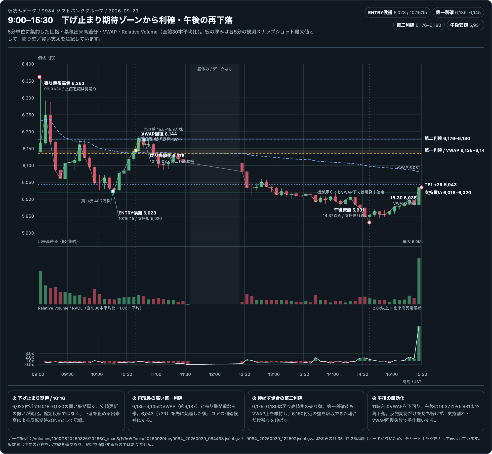
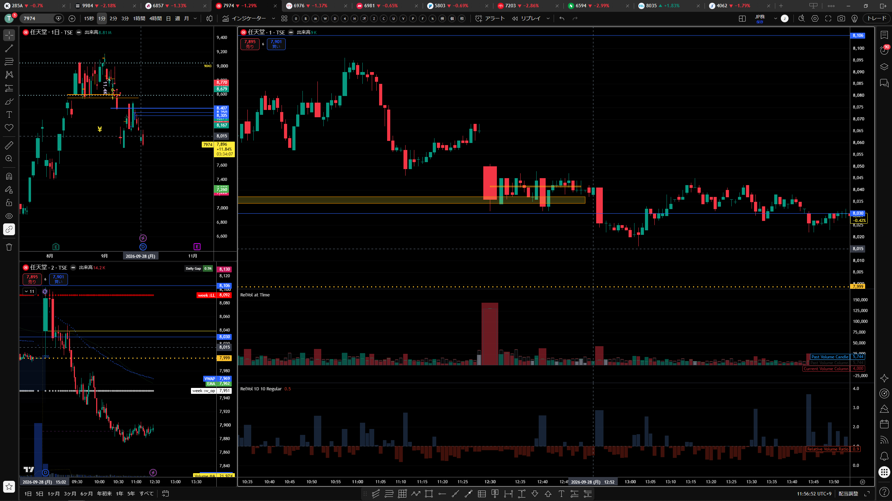

# 2026年9月29日（火）本番トレード日誌｜9984・285A 実績と板読み復習

## 記録の位置づけ

本日は、松井証券の約定CSV、9984・285Aの板読みデータ、価格推移、出来高、VWAP、下落停止型・出来高反転の定義を照合した。

`/Users/th/Downloads/stockorder_20260929.csv` には、9984のLONG 1回、9984のSHORT 1回、285AのSHORT 1回が約定済みとして記録されている。したがって、**実約定とチャート上のENTRY候補を分離して記録する**。下記の損益はCSVの約定単価から算出した手数料・税引前の概算である。

> **本番口座ステータス：CSVで約定確認済み**
>
> **本番粗損益：+4,900円（手数料・税引前）**
>
> 画像に表示された別銘柄の注文通知は、CSVとの照合が取れないものを実績損益へ含めない。

## 0. 本日の結論

9984は、寄り直後に6,362円まで上昇した後、下落レッグを形成した。10:16:15頃、6,023円付近で6,018–6,020円の買い板が観測され、10:16:23には6,018円まで下げたものの、その後の下落が連続しなかった。

本番CSVでは、9984を10:17に6,025円で買い、10:21に6,037円で売却して+1,200円。午後は9984のSHORT 2枚で+200円、285AのSHORT 1枚で+3,500円となり、CSV確認分の粗損益は合計+4,900円だった。

この場所は、反転が確定した場所ではない。しかし、売り出来高に対して価格が下へ進まない、後続足の値幅が縮小する、支持帯下に無効化ラインを置ける、という条件が重なったため、**下落停止型・出来高反転の反転期待値ZONE**としてLONG ENTRY候補になった。

その後は、6,043円、6,135–6,145円、6,176–6,180円へ順に上昇した。最も再現性が高い利確位置は、VWAPと売り壁が重なる**6,135–6,145円**。6,176–6,180円は残りを伸ばす第二目標であり、全量をそこまで引っ張る場所ではない。

11時以降はVWAPを下回り、午後には14:37頃に5,931円まで再下落した。したがって、午前の反転期待ZONEが機能したことと、一日を通して上昇が続くことは分けて記録する。

### 本日の一文

> **下落停止型・出来高反転は、反転確定後の追随ではなく、売りの努力に対して下落結果が小さくなった反転期待値ZONEから、無効化ラインを限定して短期反発を狙う。ただし、VWAPを再び下回ったら、反発シナリオを継続しない。**

### 本日の実約定サマリー

| 銘柄 | 方向 | ENTRY約定 | EXIT約定 | 数量 | 粗損益（概算） |
|---|---|---:|---:|---:|---:|
| 9984 ソフトバンク | LONG | 10:17、6,025円 | 10:21、6,037円 | 100 | +1,200円 |
| 9984 ソフトバンク | SHORT | 12:31 6,038円／12:32 6,048円 | 12:33 6,041円／6,043円 | 各100 | +200円 |
| 285A キオクシア | SHORT | 12:33、17,705円 | 12:35、17,670円 | 100 | +3,500円 |
| **合計** |  |  |  |  | **+4,900円** |

9984の朝の実約定は、板読み上のENTRY候補6,023円に近い6,025円で成立した。一方、チャート上の第一利確候補6,043円まで待たず、6,037円で実際に手仕舞っている。この差を「理想シナリオ」と「本番の実行」の比較材料として残す。

## 1. 相場環境

### 225％Rと60分足

- 225の％Rは下側。
- 60分足も下降目線。
- 9984のLONGは順張りではなく、下降トレンド中のカウンタートレンドLONGとして扱う。
- 反発しても、上位足のトレンド転換とは判断しない。
- 第一目標はVWAP・直近抵抗・戻り高値とし、利確を遅らせない。

この環境では、下落停止型・出来高反転が成立しても「上昇トレンドに転換した」とは言えない。支持帯維持、値幅縮小、VWAP回復、売り壁の吸収を段階的に確認する必要がある。

## 2. 9984の9:00–15:30値動き

| 時刻・水準 | 観察内容 | 日誌上の扱い |
|---|---|---|
| 09:00 | 寄り付き6,139円 | 初期値 |
| 09:01:30 | 寄り直後高値6,362円 | 高値追随は見送り、下落後を待つ |
| 10:16:15 | 6,023円付近。直下6,020円に買い板 | ENTRY候補、反転確定ではない |
| 10:16:23 | 6,018円まで下落 | 支持帯の最終確認・無効化候補 |
| 10:17 | 松井証券CSVで9984を6,025円で100株買い約定 | チャート候補6,023円に近い本番ENTRY |
| 10:20頃 | 6,043円へ到達 | 先行利確、約+2R目安 |
| 10:21 | 松井証券CSVで9984を6,037円で100株売り約定 | 朝のLONGを+1,200円で手仕舞い |
| 10:37–10:39 | 6,135–6,145円へ到達。VWAP約6,137円を回復 | 第一利確のコアZONE |
| 10:40頃 | 6,150円付近に大きな売り壁 | 壁の吸収を確認する場面 |
| 10:43–10:48 | 6,176円、最終的に6,188円付近まで上昇 | 第二利確・伸ばす分の候補 |
| 11:00以降 | VWAP下へ戻る | 午前の反転継続を停止 |
| 14:37頃 | 午後安値5,931円 | 下落停止仮説の一日継続を否定 |
| 15:30頃 | 6,035円 | VWAP約6,081円を回復できず |

### 午後の実約定

- 12:31に9984を6,038円で100株売り、12:32に6,048円で100株売り。
- 12:33に6,041円と6,043円で各100株買い戻し。2枚合計の粗損益は+200円。
- 285Aは12:33に17,705円で100株売り、12:35に17,670円で買い戻し。粗損益は+3,500円。
- 画像には8035の11,420円・100株の成行買い通知が表示されているが、今回のCSVに8035の行はないため、実績・損益には含めず未照合として扱う。

## 3. 板読みの根拠

板は、数量だけでなく「圧力 → 反応 → 継続」の順に読む。

### 10:16の反転期待値ZONE

- ENTRY候補：6,023円。
- 直下の6,020円付近に約40.7万株の買い板。
- 6,018円まで下げたが、安値更新が連続しなかった。
- その後、6,043円まで戻り、短時間で下落の結果が反転した。
- これは「買い板が厚いから必ず反発する」のではなく、売りの努力に対する下落結果の小ささを重視する。

### 上昇後の売り壁

- 6,150円付近：約43.5万株の売り壁。
- 6,180円付近：約15.5–15.8万株の売り壁。
- 6,135–6,145円は、VWAPと売り壁手前が重なるため、第一利確の再現性が高い。
- 6,176–6,180円は戻り高値側の第二目標。売り壁を吸収できなければ、全量を残さない。

## 4. 利確方法の検証

### 優先順位

1. **先行利確：6,043円**
   - 6,023円エントリー候補に対して約+20円。
   - 初期リスクを約10円と置く場合の+2R目安。

2. **コア利確：6,135–6,145円**
   - VWAP約6,137円と売り壁が重なる。
   - 到達時点で一部または中心ポジションを利確する。
   - 今回最も再現性の高い利確帯。

3. **残りを伸ばす：6,176–6,180円**
   - 戻り高値側の売り壁。
   - VWAP上を維持し、6,150円付近の売り壁を吸収できた場合だけ残す。
   - 必達目標ではなく、相場が強い場合の追加目標。

### 本番約定との比較

9984の朝のLONGは、6,025円で買い、6,037円で売って+1,200円となった。チャート上の第一利確帯6,043円には届く前に手仕舞っているため、今回は「反転期待値ZONEへの進入」は再現したが、「第一利確帯まで保有」は実行していない。午後の9984 SHORTは合計+200円、285A SHORTは+3,500円だった。いずれも手数料・税引前であり、CSVにない注文は合算していない。

### 無効化

- 6,018–6,020円を明確に割る。
- 下落出来高が再増加し、安値更新が続く。
- 6,135–6,145円に届かず、VWAP回復にも失敗する。
- 反発後に再びVWAP下へ戻り、戻り高値を切り下げる。

## 5. 任天堂7974との比較

9984と7974は、どちらも225％Rが下側、60分足も下降目線の環境で、下落周辺からLONGを検討した比較例である。

| 比較項目 | 9984 ソフトバンク | 7974 任天堂 |
|---|---|---|
| 最近のボラティリティ | 上昇 | 低下 |
| 反転候補 | 10:16:15、6,023円付近 | 12:40:15頃の観察 |
| 根拠 | 陰線・出来高後に下げが進まず、後続足も小さくなった | 25,900株程度の売りとNダウ支持帯で一度停止 |
| その後 | 6,135–6,145円、6,176円方向へ反発 | 12:53に強い陰線で支持帯を割った |
| 判定 | 反転期待値ZONEが一時機能 | 低ボラによる支持割れの失敗例 |

比較から、同じ「下落後に止まったように見える形」でも、ボラティリティの違いで支持帯の信頼度と反発の値幅が変わることが分かる。任天堂は低ボラのため、反転確定前の先行LONGには追加条件が必要だった。

## 6. 定義書への反映内容

本日の9984を、次の定義で追加した。

> **下落を止める出来高による反転**：売り出来高を伴う陰線が出ているにもかかわらず、価格がその出来高に見合うほど下がらず、支持帯で跳ね返る現象。上昇を保証するものではないが、反転期待値が高く、無効化ラインを限定できるZONEとしてLONG ENTRYを検討する。

9984は、この定義の成立例候補として、7974は低ボラティリティ下で支持帯を割った失敗例として、定義書に追加した。

## 7. 実績との区別

| 項目 | 本日の扱い |
|---|---|
| 9984 10:16:15 / 6,023円 | 板読み上のENTRY候補。実約定未確認 |
| 9984 10:17 / 6,025円 → 10:21 / 6,037円 | 松井証券CSVで確認した実約定。粗損益+1,200円 |
| 9984 12:31–12:33 | SHORT 2枚のCSV約定。粗損益+200円 |
| 285A 12:33–12:35 | SHORT 1枚のCSV約定。粗損益+3,500円 |
| 6,043円、6,135–6,145円、6,176–6,180円 | 検証上の利確候補。実決済とは分離 |
| 9984 14:37頃の5,931円 | 板読みデータで確認した午後安値 |
| 松井証券の本日約定 | `stockorder_20260929.csv` で9984・285Aを確認 |
| 本番粗損益 | +4,900円（CSV約定単価による手数料・税引前概算） |
| 8035の画面通知 | CSVに行がないため未照合、損益に含めない |

## 8. 9:00–15:30板読み復習チャート

この形式を板読みデータがある日誌の標準とする。価格は5分単位に集約し、累積出来高差分・VWAP・買い板・売り壁を同じ時間軸で確認できるようにした。さらに、添付されたRelative Volumeの考え方に合わせ、`RVOL = 当該バーの出来高 ÷ 直前30本の平均出来高` をオシレーターとして追加した。1.0xが平均、2.0x以上は出来高異常候補として見る。RVOLは異常値を検知し、板読みを開始するための指標合図として必要だが、トレンド・売買方向・ENTRYを確定するものではない。RVOL上昇を合図に、陰線・安値更新停止・板の反応・VWAP・相関を続けて読む。ENTRY候補、第一利確、第二利確、午後安値、午後に反転仮説が無効化した地点を一枚で復習できる。昼休みのデータ欠落は補間していない。9:00開始のため、オシレーター先頭部分は表示範囲内で利用できる直前本数による暫定値である。なお、このチャートの6,023円は板読み上の候補であり、松井証券CSVで確認した実約定は6,025円買い・6,037円売りである。

## 9. 画像資料

### 9984 ソフトバンクグループ

### 7974 任天堂

## 10. 次回の実行ルール

- 225％R下・60分足下降のときは、LONGをカウンタートレンドとして扱う。
- 高出来高の陰線だけでは入らず、安値更新停止と後続足の値幅縮小を確認する。
- ENTRY候補では、支持帯下の無効化ラインと第一利確を同時に決める。
- 先に+2R目安を処理し、VWAP・売り壁の第一利確帯で中心ポジションを確定する。
- 戻り高値側へ伸ばすのは、VWAP上の維持と売り壁吸収が確認できた場合だけにする。
- VWAPを再び下回り、安値更新が続いたら、午前に機能した反転仮説を午後まで引き継がない。

## 11. GitHubの2026-09-29 MDを追記・整理

### 出典と扱い

ユーザーが提示したGitHubの次の2つのMDを、本日誌の補足記録として整理した。

- [2026-09-29 日本株デイトレード実況記録](https://github.com/mboxxobm/tradeDaily2026/blob/main/2026-09-29_daytrading_log.md)
- [2026-09-29 トレード振り返り](https://github.com/mboxxobm/tradeDaily2026/blob/main/2026-09-29_trade_review.md)

これらは実況・観察・振り返りの記録である。時刻・価格・数量・損益の確定には松井証券の約定CSVを優先する。したがって、GitHub MDにある9984の「6,038円ロング→6,100円利確、約+62円」は、実況・振り返り上のシナリオまたは検証記録として保存し、CSVで確認した実約定とは別に扱う。

### 11-1. 9月29日の地合いと基本シナリオ

- 日経平均は60分SMA・％R・CFD全体が下方向で、基本は下目線。
- ％Rは15分足の`%R 60`と60分足の`%R 15`を確認し、センターラインの`-50`を下回る状態を下方向として認識する。記録上は一時`-60`付近まで低下した。
- NASDAQ（US100）はN字ダウで上昇を試す形がある一方、インジケーターは下方向。NY時間2時頃の戻り後にチャネル下落となり、％Rが`-60`をまだ明確に割っていないため、一部は中立として観察した。
- 本日の分岐は「下げ継続からSellを狙うか」「下げ止まりから反発LONGを狙うか」。大きく下げた後は、下げ止まり・出来高急増・吸収・ピンバー・ダイバージェンス・安値更新失敗を確認してから反発を検討する。

### 11-2. 個別銘柄・特殊要因の整理

- **285A キオクシアHD**：3分割後の価格帯を観察。日経平均や主要シンクロ銘柄と同時に下落していたため、まず下げ止まりを待つ。価格の大きさに対する心理的な躊躇と、レンジ上限からの戻り売りというテクニカル判断は分ける。
- **6857 アドバンテストほか**：9月末の配当・権利落ちと実際の売り圧力が混在する可能性がある。ヒートマップが赤くても、前日比マイナスをすべて純粋な弱さと決めつけない。
- **8035 東京エレクトロン**：5分割後の価格を基準に見る。**4062 イビデン**は2分割後、**285A**は3分割後のサポート・レジスタンス、出来高、キリ番で判断する。分割前の株価をそのまま比較しない。
- **6533 Orchestra Holdings**：ストップ高付近では、張り付きの事実だけで買わず、剥がれた後に売り板が吸収され、再びストップ高を試せる買いがあるかを確認する。

### 11-3. RVOLの位置づけと設定

GitHub MDで整理されていたRelative Volume at Timeの検証内容を、現在の日誌ルールへ統合する。

- 15秒足の出来高は、大口の瞬間的な売買、ピンバー、吸収、下げ止まり、ダイバージェンスを読むために使う。
- Relative Volume at Timeは、現在の出来高を過去の同時刻・同条件の平均と比較し、「その銘柄の今日の出来高の温度感」を見る。`1.0`は平均、`0.8`は平均未満、`1.3`は約30％多い、`1.5`は約1.5倍の目安である。
- 基本設定はAnchor／Timeframeを1日、Lookbackを10前後、1分足を全体の温度感、15秒足をENTRY周辺の確認に使う。累積モードは寄り付きからの進捗比較、Point-to-Point／Relative Volume Columnsは瞬間的な山の発見に向く。
- `Time 9:30`は時間帯比較の基準設定に関係する。東京市場を固定1日で見るときは、寄り付き9:00を基準にし、9:30を売買判断の単独根拠にはしない。
- RVOLは異常値を検知して板読みを開始する**指標合図**であり、トレンド・売買方向・ENTRYを確定しない。RVOL上昇後に、価格の努力と結果、板の圧力・反応・継続、VWAP、225との相関を確認する。

### 11-4. 9984の実況記録と利確反省

GitHub MDの9984に関する観察は、次の流れとして整理できる。

1. 日経平均が下向きのなか、9984は相対的にボラティリティが大きく、下げ止まった場合の反発値幅が期待できる銘柄として監視した。
2. 大きな陰線、再下降の出来高、ピンバー状の買い反応を確認し、「ボラが大きいから買う」のではなく「ボラが大きい銘柄で下げ止まりサインが出たら買う」という仮説を置いた。
3. 実況・振り返りでは6,038円から6,100円までの約62円、最大約200ティック、3ロットなら約3万円という伸びしろが記録されている。ただし、これは実績CSVの損益ではなく、利確反省・機会損失の検証値として保存する。
4. 本番CSVの確定値は、10:17に6,025円で100株LONG、10:21に6,037円で返済、粗損益+1,200円である。したがって、実際の課題は方向ではなく、ロット配分と「VWAP→押し目の戻り高値→直近高値」の分割利確管理だった。

### 11-5. NY時間のUS100・サンディスクの振り返り

- US100はカップ＆ハンドルを事前シナリオとし、NY開始直後にハンドル支持帯まで急落した後、オーバーシュート、V字反発、N字上昇で上側へ戻した。
- 途中の小さなレンジや一時的な失速だけで大きなパターンを否定せず、支持帯の維持・V字回復・N字上昇・上側ターゲットの順で評価する余地があった。
- サンディスクは、指数の上昇シナリオが継続していたにもかかわらず、「最近ボラが低い」という先入観で利確を早めた。個別の過去印象より、当日の指数・個別の構造・出来高を優先する。

### 11-6. 9月29日からの統合ルール

> **事前の先入観より、当日のチャート構造を優先する。**

次回は、`大きなパターン → 指数・％R → 個別銘柄 → RVOL → 15秒足の価格反応 → 板の圧力・反応・継続 → ENTRY → 分割利確`の順で確認する。225％R下・60分足下降のLONGはカウンタートレンドとして扱い、第一利確を先に確保し、VWAPと売り壁を維持できる場合だけ戻り高値側へ残す。VWAPを再び下回り、安値更新が続いたら、午前の反転仮説を午後へ持ち越さない。

## 保存情報

- 本文：`outputs/diary_20260929/diary_20260929.md`
- HTML版：`outputs/diary_20260929/diary_20260929.html`
- 定義書：`/Users/th/Documents/_TradeDaily/stopping_volume_reversal_long_definition.md`
- 板読みチャート（RVOLオシレーター付き）：`/Users/th/.codex/visualizations/2026/09/10/01a08b56-f5f1-70c0-95ab-d3f4a4fe5ca5/board-reading-9984-20260929.html`
- 板読み入力：`/Volumes/1000GB20260826/2026BC_imac3/板読みTools/20260929tue/`
- 松井証券約定CSV：`/Users/th/Downloads/stockorder_20260929.csv`
- GitHub実況・振り返り原文：上記「11. GitHubの2026-09-29 MDを追記・整理」のリンクを参照
- 種別：本番日誌・板読み検証版（9984・285Aの約定確認済み）
