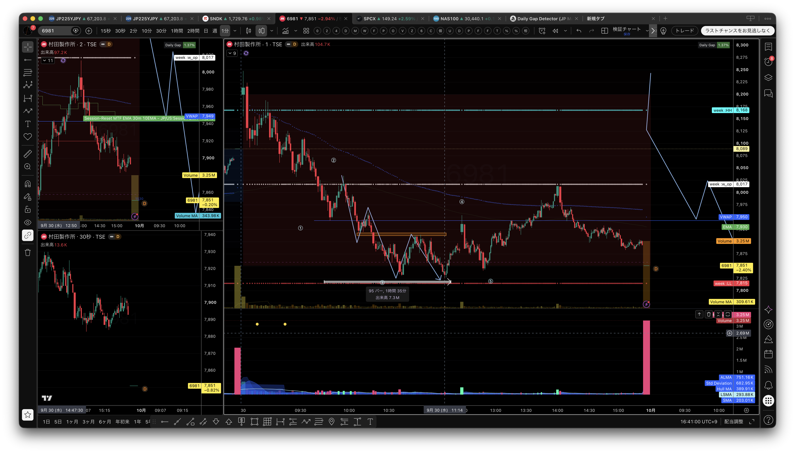
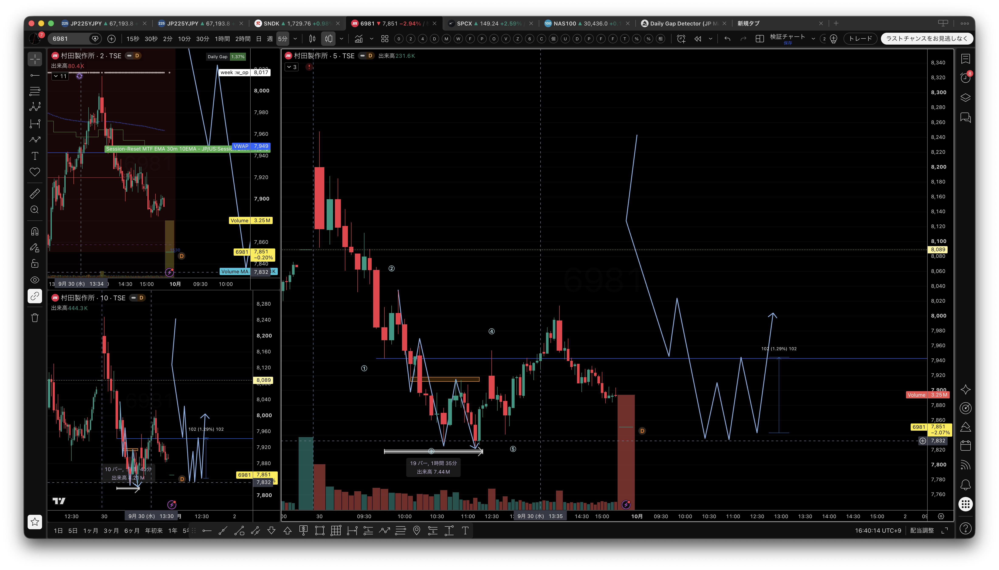
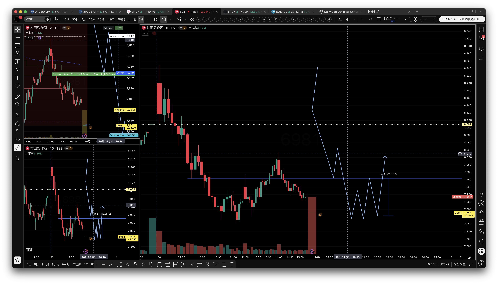
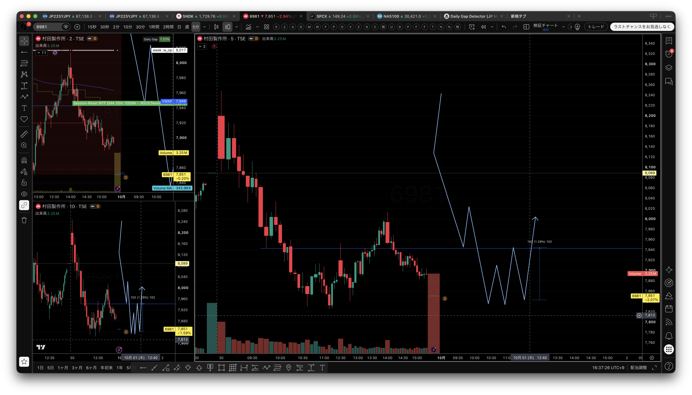

# 2026年9月30日（水）日本株デイトレード日誌｜285A・7974・6981と板読み

> **本番確定版**：板読みデータは9:00〜11:35ごろと12:25〜15:31ごろ、松井証券CSVは12:44までを確認。11:35〜12:25ごろは昼休みのため板観測が空白で、そこは補間していない。CSVと板JSONLを分けて記録し、9:00〜15:30の終日チャートを反映した。

## 0. 本日の結論

- **CSV確認済み粗損益：−4,200円**（手数料・税引前概算）。
- **285A キオクシア：+500円**。10:12のSHORT損切りを、10:17以降のLONGと後半の反発で取り返した。
- **7974 任天堂：−3,000円**。下げ止まりを狙ったLONGを2回試したが、どちらも支持が続かず損切り。
- **6981 村田製作所：−1,700円**。12:32のLONGを12:44に返済。12:25以降の板データも確認し、昼休み明けの価格反応をチャートに反映した。
- **9984・6857・1321：実約定は今回のCSVで未確認**。板読み・指数連動の観察銘柄として記録する。
- **板データの最終観測は15:31ごろ**。CSVの最終約定は12:44。11:35〜12:25ごろの昼休みだけはデータ空白として残した。

本日の中心テーマは、下方向の地合いまたは銘柄個別の下落の中で、**売りが出ても価格が進まない場所を「反転期待値ZONE」として読めるか**だった。

ただし、厚い買い板やRVOL上昇だけで反転を確定しない。価格が安値を更新できないこと、後続足が縮小すること、VWAPや指数との位置関係が改善すること、そして無効化ラインを置けることを合わせて判断する。

## 1. データの扱い

### 確定データ

- 松井証券CSV：`/Users/th/Downloads/stockorder_20260930 (1).csv`
- 板読みJSONL：`/Volumes/Documents/043kabustationData/20260930wed/`
- CSVの約定数量・約定単価・約定時間を実約定の基準とした。
- 板データの価格はスナップショットの現在値、出来高は累積 `TradingVolume` の差分、板IMBは上位5本の買い数量と売り数量の差から作成した。

### 観察・未確認データ

- 音声実況の価格、出来高、板の厚みは当時の観察として記録し、CSVや板JSONLで直接一致しないものは「報告」「観察」と表記した。
- 板JSONLは午前チャンクと12:25以降の午後チャンクに分かれている。検証ファイルでは午後チャンクのparse error 0、missing book rows 0を確認した。
- 板数量は注文の存在を示すが、約定・取消・成行方向を単独では確定しない。
- 実況で報告された285Aの18,355円利確、約14万株の売り吸収、11:12ごろの98,000株ピンバーは、今回のCSVのどの約定に対応するか未確認である。
- 保有中に考えた4,500円の許容損失は、実現損益ではない。
- TDK（6762）の9:24出来高・9:44サポート割れは実況の振り返りであり、今回のCSV実約定としては確認していない。
- 村田製作所（6981）の11:14ごろの売り吸収観察、12:45〜12:48の下落・反発観察は実況内容である。CSVではその前の12:32買い→12:44返済が確認できるため、後の値動きを実約定の保有中の反応とは扱わない。12:25以降の板スナップショットは取得できているが、板だけで約定の因果までは確定しない。

## 2. 朝の環境認識

### US100

- 9:29時点のWilliams %Rは約−47で中間付近。
- 前日の2時ごろからのレンジを上抜け、上昇後に同じ価格帯を試すダブルトップ状の動きを観察。
- 下降トレンドラインを上抜け、半値戻しを挟みながら、カップ・アンド・ハンドルのハンドル部分の支持を割らずに戻していると認識した。
- 月足・週足はN字のダウで上方向を意識。日足は高値付近のクラスター／レンジとして観察した。

### 日経225

- 日足はレンジ上限付近。1時間足の方向には迷いがある一方、60EMAは上向きとの認識。
- 9:37ごろは10分足で下げていたが、本日安値を更新できず戻したため、下方向の継続は未確認とした。
- 「%Rではまだ上方向で山ができている」は日経平均についての発言であり、285Aの指標とは分けて記録する。
- 10時台は黄色いサポート帯の攻防、サポレジ越え、押し戻しを繰り返した。指数が上でも、個別が期待どおり加速するとは限らないことを確認した。

## 3. 前場の実況タイムライン

| 時刻 | 銘柄・対象 | 観察／本人の説明 | 日誌上の扱い |
|---|---|---|---|
| 09:29 | US100 | %R約−47。レンジ上抜け、ハンドル支持を観察。 | 環境認識・未独立検証 |
| 09:32 | 9984 | 6,252円、本日安値6,225円との画面読み取り。約4.97%ギャップアップ。 | 画像・実況観察 |
| 09:37 | 日経225 | 下げたが本日安値を更新できず戻す。 | 下げ継続は未確認 |
| 09:24 | 6762 TDK | 3,000円付近で約15万株の大出来高があったとの後日の振り返り。 | 実況観察・板未照合 |
| 09:44 | 6762 TDK | それまでの支持帯を下抜けた場面を、セル候補として振り返った。 | 実行・約定は未確認 |
| 10:02 | 285A | サポレジが効き、ピンバーから上昇したとの報告。 | 反発候補の実況観察 |
| 10:12 | 285A | 下へのブレイクを見てSHORT。上への戻りと指数の上向きで迷い、損切りを報告。 | CSVでSHORT損失を確認 |
| 10:17–10:22 | 285A | 日経連動のLONG。18,445円の高値更新を後に訂正。 | CSVでLONG +4,000円を確認 |
| 10:21前後 | 7974 | 7,850円付近で、売られても下がらない反応を観察。 | LONG根拠の実況観察 |
| 10:26–10:39 | 7974 | 初回LONG後、支持が続かずロスカット。 | CSVで−1,600円を確認 |
| 10:45–10:48 | 7974 | 再エントリー後も7,851円付近を割り、再度ロスカット。 | CSVで−1,400円を確認 |
| 10:48–11:07 | 285A | 低ボラの中で再度LONG。18,355円での利確報告とは別に、CSVで18,385→18,370、18,330→18,350を確認。 | CSVで−1,500円、+2,000円 |
| 11:08 | 285A | 下方向の動きを見てSHORTを検討。 | 新規実行は未確認 |
| 11:12 | 285A | 大陰線後に下がらない反応、ピンバー98,000株との報告。 | 数値・足・約定対応は未確認 |
| 11:14–11:19 | 285A | 後半の反発をLONG。18,330円付近で利確したとの実況。 | CSVで18,265→18,300、+3,500円を確認 |
| 11:55ごろ | 6762 TDK | 9:44セル候補を振り返り。リスク約4,400円、利確候補約8,200円という想定を共有。 | 実約定・SLは未確認 |
| 12:32–12:44 | 6981 | LONG 7,902円→7,885円、100株。 | CSVで−1,700円を確認 |
| 12:45–12:48 | 6981 | CSV返済後の時間帯に下落し、支えられて7,911円方向へ戻したとの実況。 | 実況観察・板は取得済み |

## 4. 285A キオクシアホールディングス

### 板読みデータの終日集計

- 観測範囲：09:00:00〜15:31:03。11:35〜12:25ごろは昼休みのため空白。
- スナップショット：113,400件。5分足に集約してチャート化。
- 価格レンジ：**17,920〜18,460円**。最終観測価格：18,095円。
- 最終観測VWAP：約**18,212円**。
- 累積TradingVolume：約**3,913万株**。
- 上位5本の板IMBは、寄り直後や午後の終盤で買い側・売り側への偏りが入れ替わった。板の偏りは固定ではなく、価格反応と合わせて読む。

### 売りからLONGへの切り替え

実況では18,240円付近の下抜けで売るかを迷い、10:12以降にSHORTを実行したと報告している。その後、上に戻す動きと日経225の上向きを見てSHORTを損切りし、LONGへ切り替えた。

松井証券CSVで確認できる最初の組み合わせは次のとおり。

- 10:12 SHORT：18,320円で100株 → 10:15に18,395円で返済、**−7,500円**。
- 10:17 LONG：18,375円で100株 → 10:22に18,415円で返済、**+4,000円**。

285Aは18,445円まで高値を更新したとの実況報告があるが、今回の板JSONLで確認できる前場高値は18,460円である。高値更新があっても期待した吹き上がりが続くとは限らず、指数が上でも個別の買いが続くかを別に確認する必要があった。

### 18,305〜18,315円の反転期待値ZONE

実況では18,305円付近を割らず、約14万株の売りが出ても下がらなかったと観察している。この「売りの努力に対して価格の下落結果が小さい」という読みは、下落停止型・出来高反転の候補条件に合う。

ただし、これは反転確定ではない。今回の定義では、次の順で扱う。

1. 陰線・大出来高・売り板など、下方向の圧力を確認する。
2. 安値更新が止まり、後続足が縮小するかを見る。
3. 買い板の厚さではなく、価格が下がらない反応を確認する。
4. 18,305〜18,315円を割った場合の無効化を先に決める。
5. VWAPまたは直近戻り高値までの値幅とリスクを比較して、サイズを決める。

その後のCSVでは、10:48のLONGが18,385→18,370円で**−1,500円**、10:59のLONGが18,330→18,350円で**+2,000円**、11:14のLONGが18,265→18,300円で**+3,500円**だった。285AのCSV確認分は合計**+500円**である。

実況の18,355円利確、18,285円までの急落、11:19ごろの18,330円付近利確は、CSVで確認した各約定と一対一に対応付けられていない。したがって、チャートには実況イベントとして注記し、CSV損益にはCSVの約定だけを採用する。

## 5. 7974 任天堂

- 観測範囲：09:00:00〜15:31:04。11:35〜12:25ごろは昼休みのため空白。
- 価格レンジ：**7,847〜7,984円**。最終観測価格：7,944円。
- 最終観測VWAP：約**7,929円**、累積TradingVolume：約**673万株**。
- 実況では7,850円付近で売られても下がらない反応、9月11日安値、出来高の突出を根拠にLONGを検討した。
- 約7万9千株は「買い注文の確定数量」ではなく、売られても下に進まなかった場面の出来高として訂正された。

CSVで確認できる実績は、次の2回のLONGと損切りである。

- 10:26〜10:39：3枚合計300株、**−1,600円**。
- 10:45〜10:48：3枚合計300株、**−1,400円**。
- 7974合計：**−3,000円**。

同じ価格帯で「売られても下がらない」反応が一度見えても、支持が継続しなければLONGの再現性は低い。低ボラ銘柄では、先行LONGのサイズを抑え、VWAP回復または安値更新失敗の再確認を待つ方が安全である。

## 6. TDK（6762）｜9:44サポート割れのセル候補

11:55ごろの振り返りでは、TDKの1分足・2分足で3,000円付近の価格帯を確認した。9:24ごろに約15万株の大きな出来高が出た後、いったん支えられた価格帯を下方向へ抜け、9:44ごろのサポート割れがセル候補になったという整理である。

- 3,000円付近で買われた価格帯を、最初の観察基準にする。
- 大出来高の後に価格が上へ戻せず、支持帯を明確に割ったら、下方向の継続候補として見る。
- 利確候補は前日終値・前々日終値付近。振り返りではリスク約**4,400円**に対し、約**8,200円**の利確余地という想定が共有された。
- 「高値ブレイクアップに沿ってのセル」という実況上の表現は残すが、どの高値・どの時間足を指すかは板JSONLと約定履歴で未照合である。
- TDKについては今回の松井証券CSVに対応する実約定、正確なストップロス価格、数量を確認できていない。したがって、これは実績トレードではなく、**大出来高→支持崩れ→戻り売りを検証する仮説パターン**として記録する。

再現性を高めるには、9:24の大出来高だけで売らず、①支持帯の再テスト、②反発失敗、③9:44の下抜け、④ストップ位置と前日・前々日終値までの値幅、の4点を事前に固定する。

## 7. 6981 村田製作所・9984・6857・1321の板読み比較

| 銘柄 | 終日レンジ | 最終観測 | VWAP | 累積出来高 | 今回の扱い |
|---|---:|---:|---:|---:|---|
| 9984 ソフトバンクG | 6,035–6,477円 | 6,430円 | 約6,381円 | 6,519.45万株 | ギャップアップ後の下落・反発を終日観察。CSV実約定なし |
| 6981 村田製作所 | 7,825–8,248円 | 7,851円 | 約7,950円 | 2,463.27万株 | 12:32 LONG→12:44返済をCSV確認。粗損益−1,700円。昼休み以外は板確認済み。 |
| 6857 アドバンテスト | 33,880–34,920円 | 34,260円 | 約34,283円 | 2,372.34万株 | 高ボラ・レンジ・出来高増加を終日観察。CSV実約定なし |
| 1321 NF日経225 | 68,760–69,700円 | 69,620円 | 約69,226円 | 24.75万株 | 個別の方向確認に使う指数連動商品の終日観察 |

### 村田製作所の後場追記

実況では11:14ごろ、約10万株の売りが出ても価格が下がらない「中での強さ／支え」を観察し、LONGを検討した。その後、12:45〜12:48ごろに下落してから支えられ、7,911円方向へ戻す動きが報告された。一方、7,948円をダウの分岐点として、指数と村田製作所の方向が分かれる場面を意識していた。

CSVで確認できる実約定は、**12:32に7,902円で100株LONG、12:44に7,885円で返済、−1,700円**である。板JSONLは12:25以降15:31ごろまで取得できているため、12:32〜12:44の時間帯も板スナップショット・出来高・RVOL近似を確認できる。ただし、板数量は注文の存在を示すだけで、CSV約定の方向や因果を単独では確定しない。また、12:45〜12:48の実況観察はCSV返済後であり、今回のポジションを保有したままの反発とは扱わない。

この取引の良かった点は、指数と個別の方向が食い違い、「分からない」と感じた時点で撤退したこと。改善点は、11:14の下げ止まり観察から12:32のENTRYまでに板データが連続しているか、7,948円の分岐点を回復できるかを確認し、確認できない場合はサイズを落とすか見送ることである。

### 村田製作所｜5分足の波形・ダブルボトム・ピンバーの振り返り

今回共有したチャートでは、5分足を大きな構造、1分足・30秒足をENTRY候補の細部として見直した。以下は、確定した波動理論ではなく、当日の値動きを復習するための本人の波形仮説である。

#### 1. 5分足で見た下降波

- 9:45ごろの安値、9:55ごろの戻り高値を起点に、安値を切り下げる下降の流れを形成した。
- その後、11:35ごろの安値が下降3波の終点候補になったと見ている。
- 11:15ごろには、戻り高値側のサポレジにまだタッチしていない状態で、ダブルボトムに近い形が出現した。
- ダブルボトム付近のピンバー様の反応は、5分足より下の時間足で見ると、売りが出ても下に進みにくくなり、買いが入り始めた候補として読めた。

このため、戻り高値側の**7,941円付近までのロング**を狙う考えになった。しかし、実際には5波の戻りが7,941円まで届かず、狙った方向性はあっていても、きれいな形として確定した反転ではなかった。

#### 2. 10:05・10:45の戻り高値を使えた可能性

- 10:05ごろと10:45ごろには、戻り高値を基準にしたN字の下降構造が見えており、下降3波の戻し、すなわち下降4波を取る場面として整理できた。
- そこを取れないまま、5波の始点付近から上側の1波の位置へ戻る動きが出たため、全体では1・2・3・4・5の波を経た後の、6波のような戻りに見える場面になった。
- ただし、1〜5の丸印の間には小さな戻り高値がノイズのように混ざっており、どの戻りを正式な波として扱うかが曖昧になった。その結果、再追随するか、いったん見送るか、どちらへ進むのかを判断しにくくなった。

ここは「取れた可能性があった」とは言えるが、ノイズを含んだ波形を後から整えて見ている面もある。したがって、必ず取るべきだった場面と断定せず、**戻り高値の更新・安値更新の停止・出来高の再増加**が同時に揃った場合だけ、再現性のあるENTRY候補とする。

#### 3. インジケーターより、買いと売りのバランスを優先

今回の判断の中心は、インジケーター単独ではなかった。大きな出来高が出たときに、

1. 売り数量・売り出来高が出ているか。
2. それに対して価格が安値を更新できているか。
3. ピンバーや小さな陽線で、買いの反応が続いているか。
4. 戻り高値7,941円までの値幅に対して、無効化位置が明確か。

を確認し、買いと売りのバランスが変わる場所を見ようとしていた。したがって、ダブルボトムの形だけで反転確定とせず、**大出来高の後に価格が下がらないこと**を根拠の中心に置く。

一方で、今回のダブルボトムは明確なキリ番で反応したわけではない。そのため、もう一つの選択肢として、**7,800円付近までのタッチを待ち、その後の戻り売りまたは下げ止まりを確認する**考え方も残る。早いロングを狙う場合は小さく入り、ダブルボトム安値を割ったら無効化する方が、形の曖昧さに対して安全である。

#### 4. 今回の実約定との照合

狙いは「ダブルボトムとピンバー様の買い反応から、7,941円付近まで戻るロング」だったが、松井証券CSVで確認できる実約定は、**12:32に7,902円でLONG、12:44に7,885円で返済、−1,700円**である。7,941円まで戻るシナリオは実現せず、狙いどおりの反転を取れた実績とは分けて記録する。

今回の反省は、方向を考えられなかったことではなく、波形の途中にある小さな戻り高値をノイズとして整理できず、ENTRY・追随・見送りの基準が揺れたことにある。次回は、5分足の波形を先に固定し、1分足・30秒足では「ピンバー＋出来高＋安値更新失敗」の3条件が揃った場所だけを早期ENTRY候補として扱う。

#### 共有画像

以下は、今回の波形・ダブルボトム・ピンバーを復習するための画面記録である。









9984は終日の値幅と累積出来高が大きく、板の偏りも時間帯によって変化した。ボラが大きいから買うのではなく、下げ止まり・価格反応・板の継続が一致した場所だけを反転期待値ZONEとして扱う。

6857は終盤でも価格がVWAPを下回る。出来高が多く見えても、レンジの中で方向が継続するかは別問題であり、上値追いを急がない。

1321は日経225連動の地合い確認用で、個別LONGの直接根拠にはしない。指数が上向きでも個別の買い継続が弱い場合があるため、個別側の価格反応を優先する。

## 8. Relative Volume／出来高オシレーターの扱い

今回のチャートには、板JSONLの累積TradingVolumeを5分ごとの差分にし、当日直前30本の平均で割った**RVOL近似**を表示した。

- 1.0x：直前平均と同程度。
- 2.0x以上：出来高異常候補。
- 15秒足の瞬間的な大出来高とは用途が異なる。
- 今回のRVOL近似は過去同時刻の履歴を参照したTradingViewのRelative Volume at Timeそのものではなく、当日の終日板データ内で計算した補助表示である。

RVOLは「いつもより動いている可能性」を知らせる指標合図であり、トレンド・売買方向・ENTRYを確定するものではない。実際の判断は、

**大きなパターン → 指数・%R → 個別銘柄 → RVOL → 価格反応 → 板の吸収／継続 → ENTRY → 分割利確**

の順で行う。

## 9. CSV実約定一覧

| 銘柄 | 方向 | ENTRY | EXIT | 数量 | 粗損益 |
|---|---|---:|---:|---:|---:|
| 285A | SHORT | 10:12 / 18,320円 | 10:15 / 18,395円 | 100 | −7,500円 |
| 285A | LONG | 10:17 / 18,375円 | 10:22 / 18,415円 | 100 | +4,000円 |
| 7974 | LONG | 10:26 / 7,860円 | 10:39 / 7,854円 | 100 | −600円 |
| 7974 | LONG | 10:27 / 7,858円 | 10:39 / 7,853円 | 100 | −500円 |
| 7974 | LONG | 10:28 / 7,859円 | 10:39 / 7,854円 | 100 | −500円 |
| 7974 | LONG | 10:45 / 7,857円 | 10:47 / 7,853円 | 100 | −400円 |
| 7974 | LONG | 10:45 / 7,858円 | 10:47 / 7,853円 | 100 | −500円 |
| 7974 | LONG | 10:45 / 7,857円 | 10:48 / 7,852円 | 100 | −500円 |
| 285A | LONG | 10:48 / 18,385円 | 10:54 / 18,370円 | 100 | −1,500円 |
| 285A | LONG | 10:59 / 18,330円 | 11:07 / 18,350円 | 100 | +2,000円 |
| 285A | LONG | 11:14 / 18,265円 | 11:19 / 18,300円 | 100 | +3,500円 |
| 6981 | LONG | 12:32 / 7,902円 | 12:44 / 7,885円 | 100 | −1,700円 |
| **合計** |  |  |  |  | **−4,200円** |

CSVの状態欄は「−」だが、約定数・約定単価・約定時間が埋まった**24行・12組**を約定データとして集計した。手数料・税金は含めていない。6981の12:32〜12:44はCSV実績で、同時間帯の板JSONLも確認できるが、板の数量だけで約定方向や因果を確定したものではない。

## 10. 利確・損切りの再現性ルール

### 285Aの反省

1. 18,305〜18,315円は、買い板の厚さではなく「売りが出ても安値更新が続かなかった」ことを確認してから反転期待値ZONEとする。
2. 反転確定を待ちすぎると入口が遅くなるため、先行ENTRYは小さくし、無効化ラインを明確にする。
3. 反発が出た場合は、直近戻り高値、VWAP、売り壁を分割利確候補として先に置く。
4. 期待した加速が出ず、指数だけが上向きの場合は、個別の買い継続を確認できるまで全量を抱えない。

### 7974の反省

1. 出来高の突出は、買いの確定ではなく、売りと買いがぶつかった可能性を示すだけ。
2. 「売られても下がらない」が一度出ても、その後の安値更新で支持の継続を再評価する。
3. 2回目のLONGは、1回目の失敗後に同じ根拠が残っているかを確認し、サイズを下げるか見送る。

### TDKのセル候補

1. 9:24の大出来高は「その価格帯が注目された」合図として扱い、出来高だけで売らない。
2. 支持帯の再テストと反発失敗を確認し、9:44のサポート割れで初めてセル候補にする。
3. ストップロスの位置と前日・前々日終値までの利確余地を先に決め、リスク約4,400円に対して利確約8,200円という想定が崩れたら見送る。

### 6981の反省

1. 売りが出ても下がらない反応は候補条件だが、指数と個別が逆向きなら「反転確定」とは扱わない。
2. 7,948円の分岐点を回復できない、または板データが連続していない場合は、ロットを下げるか見送る。
3. 「分からない」と感じた時点で撤退する判断は再現性のあるリスク管理として残す。

## 11. 本番確定の確認事項

1. `/Volumes/Documents/043kabustationData/20260930wed` の午前・午後JSONLを読み込み、6銘柄の板データを9:00〜15:31ごろまで確認した。
2. 午後JSONLの検証結果は parse error 0、missing book rows 0。11:35〜12:25ごろは昼休みのため、チャート上も空白のままとした。
3. 次のコマンドで6銘柄のチャートとmanifestを再生成した。

   ```bash
   python3 /Users/th/Documents/TradeDayReport20260821/scripts/build_diary_20260930.py
   ```

4. CSVの実現損益は、約定済み24行・12組を集計して−4,200円。実況報告の18,355円・18,330円などとの対応が確認できないものは、引き続き観察欄に残した。
5. 昼休み以外の未取得帯がないことを確認し、本日誌を本番確定版として保存した。

## 12. 保存先

- [HTML日誌](diary_20260930.html)
- [板読みチャート・manifest](../../assets/2026-09-30/board_reading/manifest_20260930.json)
- [285Aチャート](../../assets/2026-09-30/board_reading/board-reading-285A-20260930.png)
- [7974チャート](../../assets/2026-09-30/board_reading/board-reading-7974-20260930.png)
- [6981チャート](../../assets/2026-09-30/board_reading/board-reading-6981-20260930.png)
- [9984チャート](../../assets/2026-09-30/board_reading/board-reading-9984-20260930.png)
- [6857チャート](../../assets/2026-09-30/board_reading/board-reading-6857-20260930.png)
- [1321チャート](../../assets/2026-09-30/board_reading/board-reading-1321-20260930.png)

作成日：2026年9月30日｜本番確定版｜CSV実約定12:44まで、板読み9:00–11:35／12:25–15:31｜昼休み空白・補間なし
