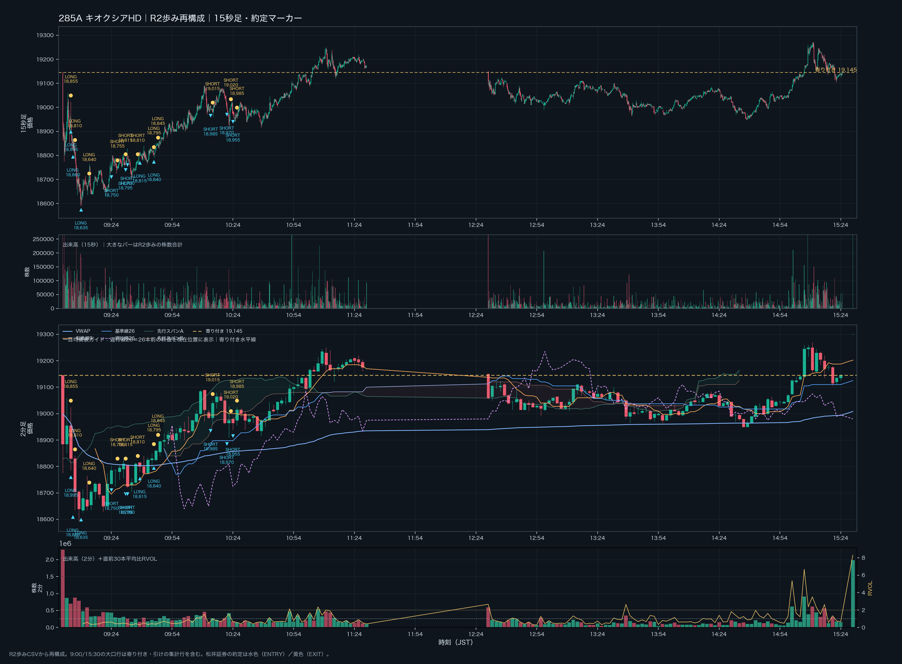
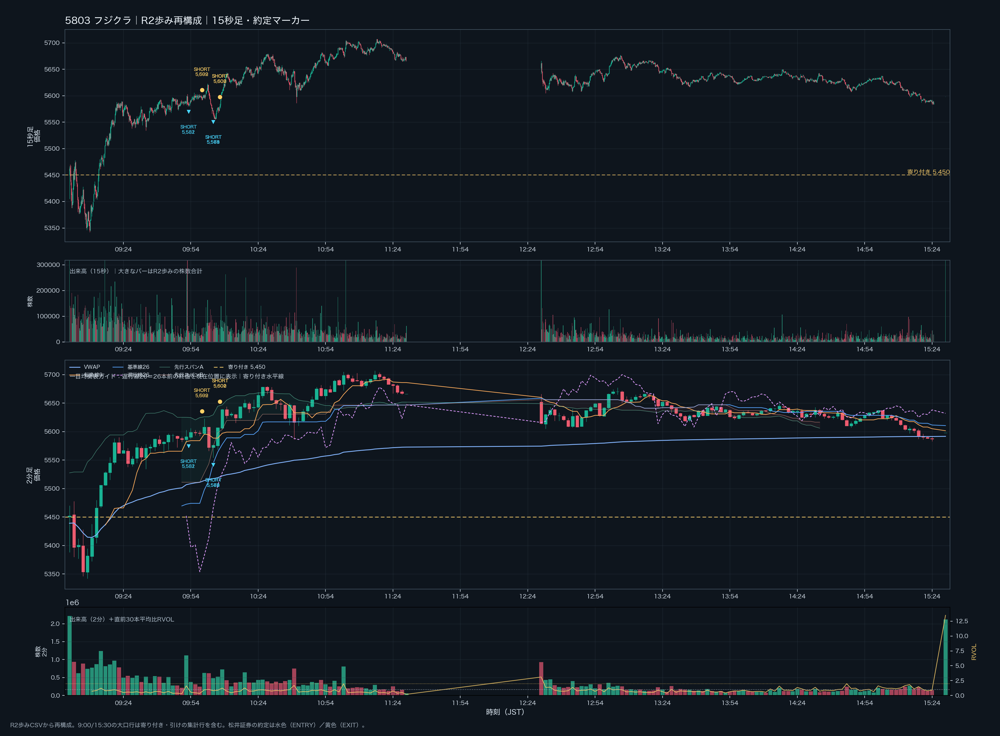
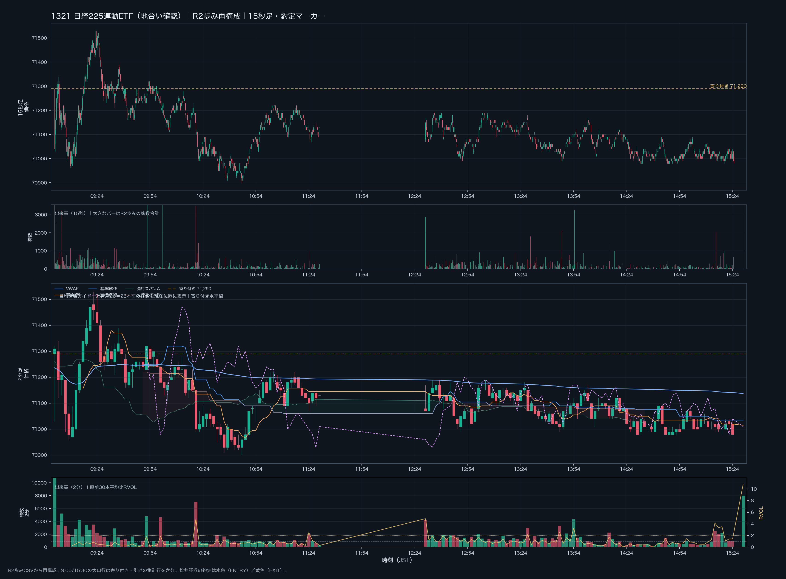

# 2026年10月2日（金）日本株デイトレード日誌｜R2歩み・松井証券約定・15秒足／2分足

> **本番確定版**：GitHubの10月2日実況・日経振り返り・TodoList・場中議事録、松井証券の注文／約定CSV、R2歩みCSVを照合した。約定は62フィル、FIFOで31組に対応付けた。松井証券の受渡金額合計と約定ペアの価格差はどちらも **−68,100円**。15秒足・2分足、2分足の一目均衡表ガイド（遅行線26を含む）、本日寄り付き水平線、出来高・RVOL、ENTRY／EXITマーカーを銘柄別チャートに反映した。

## 記録の位置づけ

- 状態：**本番／終日データ照合済み**。
- 実約定：松井証券CSVの「約定数・約定単価・約定時間」を基準にした。
- 約定ペア：同一銘柄・同一方向をFIFOで対応付けた。価格差の合計は松井証券の受渡金額合計と一致した。
- 実況：GitHubの日誌・議事録にある本人発言は、約定データで確認できたものと、本人の観察・振り返りを分けて記載した。
- 歩み：`/Volumes/1000GB20260826/BrisX/GEMINIGravity/20261002_picked/qr-<銘柄>-20261002.csv` の「値段・株数・時刻」を使用した。
- 出来高：R2歩みの株数を15秒足・2分足へ合計した。RVOLは「当該2分足出来高 ÷ 直前30本平均」で計算した。
- 9:00と15:30の大きな株数はR2に含まれる寄り付き・引けの集計行。場中のENTRY判断では、寄り付き・引けの集計行と通常の場中バーを分けて見る。

## 0. 本日の結論

松井証券の実約定では、**複数銘柄へ寄り付き直後から入り、下げ止まりを先回りしたLONGと、出来高を見て飛び乗ったSHORTが混在した**。日経平均は上位足では上方向を意識できる一方、実際の場中は「ボラティリティの大きいレンジ」であり、個別銘柄の下げ止まりが継続するかを確認しないまま入ると、指数が上でも個別は下がる場面があった。

| 銘柄 | 松井証券約定ペア | 受渡金額／価格差 | 本日の扱い |
|---|---:|---:|---|
| 285A キオクシアHD | 11組 | **−35,500円** | 下げ止まりLONG、戻り売り、再LONGが混在。売りの継続を確認できずSHORTも損失。 |
| 5803 フジクラ | 5組 | **−13,300円** | 大出来高の下抜けへSHORT。買いの歩みで踏み上げられた。 |
| 6976 太陽誘電 | 1組 | **＋3,000円** | 15秒足・2分足の下げ止まりからのLONGが機能した。 |
| 7974 任天堂 | 6組 | **−2,500円** | 買い支え・ダブルボトム候補を見たが、支持の継続前に撤退。 |
| 9984 ソフトバンクG | 8組 | **−19,800円** | 寄り付きの飛び乗りLONGと、後場のLONG／SHORTがいずれも噛み合わなかった。 |
| **合計** | **31組・62フィル** | **−68,100円** | 松井証券の受渡金額合計と一致。 |

### 今日の一文

> **上位足が上でも、ボラティリティの大きいレンジでは個別のENTRYを急がない。日経平均の位置、個別の価格反応、15秒足の出来高、2分足の出来高と遅行線を同じ画面で確認してから入る。**

## 1. 相場環境

### 日経225・上位足

- GitHubのTodoListでは、週足・日足は上昇と整理していた。
- 一方、日経225は上昇トレンドの中にあるものの、1時間足では20SMAを割り込むレンジで、上にも下にも大きく振られやすい状態と振り返った。
- 本人の表現では、**「P.O.LONGなのに上がらないレンジ」**。上方向優位という前提が、寄り付き後の個別銘柄の下落を否定する材料にはならなかった。
- 1321日経225連動ETFのR2歩みでは、寄り付き価格71,290円、日中安値70,900円、高値71,530円、終値集計行71,040円。CFDそのものではなく、地合いの補助確認として使用した。
- 5分足60EMAや%Rの数値は、今回のGitHub記録で確定値が提示されていないため推測していない。上位足の方向と場中のレンジ認識を分けて記録する。

### 個別との同期・不一致

- 日経平均が上方向でも、9984・285A・5803などは寄り付き後に売られた。
- 6976は下落後に反発が出て、今回の実約定では唯一のプラス銘柄になった。
- 7974は買い支えとダブルボトム候補が見えたが、価格がその後も安値を更新しないという継続確認が不足した。
- 指数と個別の不一致が出た時は、指数の上方向だけを理由に個別LONGを増やさない。

## 2. 9:00–15:30 値動きと実況タイムライン

| 時刻 | 対象 | 観察・約定 | 扱い |
|---|---|---|---|
| 09:00 | 全体 | R2寄り付き集計。285A 19,145円、5803 5,450円、6976 10,015円、7974 7,900円、9984 6,649円、1321 71,290円。 | 寄り付き水平線 |
| 09:01–09:02 | 9984 | LONG 6,667円 → EXIT 6,568円、100株。 | **−9,900円** |
| 09:04–09:13 | 285A | 18,995円・18,860円のLONG、続いて18,635円LONG。最初の2本は下落、3本目は小幅利確。 | **−14,000円、−5,000円、＋500円** |
| 09:22–09:23 | 6976 | LONG 9,772円 → EXIT 9,802円、100株。 | **＋3,000円** |
| 09:22 | 9984 | 6,447円LONG → 6,446円返済。 | **−100円** |
| 09:24–09:47 | 285A | 18,750円SHORT、18,795・18,790円SHORT。戻りで損切り後、18,815・18,840円LONG。 | SHORT **−4,500円**、LONG **−1,500円** |
| 09:52–09:53 | 7974 | 7,875・7,874・7,873円LONGを各100株。7,871・7,870・7,870円で返済。 | **−1,100円** |
| 09:53–10:07 | 5803 | 5,582・5,581円SHORT、続いて5,569・5,568・5,571円SHORT。買い戻しで返済。 | **−13,300円** |
| 10:02–10:03 | 7974 | 7,899・7,899・7,898円SHORT → 7,904・7,903・7,903円返済。 | **−1,400円** |
| 10:13–10:26 | 285A | 18,985、18,970、18,955円SHORT。19,015、19,020、18,985円で返済。 | **−11,000円** |
| 14:36–14:55 | 9984 | 6,299・6,293・6,293円LONG → 6,267・6,268・6,268円で返済。後に6,268円・6,267円SHORT → 6,273・6,273・6,274円で返済。 | **−8,200円** |
| 15:30 | 全体 | R2引け集計行。通常の15:30前の場中足とは分けて扱う。 | 終日確認 |

## 3. 松井証券｜ENTRY・EXIT実績

### 285A キオクシアHD

| 方向 | ENTRY | EXIT | 数量 | 価格差損益 |
|---|---|---|---:|---:|
| LONG | 09:04 / 18,995円 | 09:04 / 18,855円 | 100 | **−14,000円** |
| LONG | 09:05 / 18,860円 | 09:06 / 18,810円 | 100 | **−5,000円** |
| LONG | 09:09 / 18,635円 | 09:13 / 18,640円 | 100 | **＋500円** |
| SHORT | 09:24 / 18,750円 | 09:27 / 18,755円 | 100 | **−500円** |
| SHORT | 09:31 / 18,795円 | 09:31 / 18,815円 | 100 | **−2,000円** |
| SHORT | 09:32 / 18,790円 | 09:37 / 18,810円 | 100 | **−2,000円** |
| LONG | 09:38 / 18,815円 | 09:45 / 18,795円 | 100 | **−2,000円** |
| LONG | 09:45 / 18,840円 | 09:47 / 18,845円 | 100 | **＋500円** |
| SHORT | 10:13 / 18,985円 | 10:14 / 19,015円 | 100 | **−3,000円** |
| SHORT | 10:21 / 18,970円 | 10:23 / 19,020円 | 100 | **−5,000円** |
| SHORT | 10:24 / 18,955円 | 10:26 / 18,985円 | 100 | **−3,000円** |
| **小計** |  |  | **11組** | **−35,500円** |

**読みの振り返り**：15秒足で下げ止まりらしい陰線・買い戻しピンバーを見てLONGを検討したが、5分足では一つの押しにも見えた。戻り高値・ダウの分岐点まで届く前に下落し、SHORTへ切り替えた場面では、ネックライン下抜けが続かず陽線で戻された。大出来高だけではなく、出来高後に価格が進むか、次の安値更新が止まるかを先に確認する必要があった。

### 5803 フジクラ

| 方向 | ENTRY | EXIT | 数量 | 価格差損益 |
|---|---|---|---:|---:|
| SHORT | 09:53 / 5,582円 | 09:59 / 5,599円 | 100 | **−1,700円** |
| SHORT | 09:53 / 5,581円 | 09:59 / 5,602円 | 100 | **−2,100円** |
| SHORT | 10:04 / 5,569円 | 10:07 / 5,601円 | 100 | **−3,200円** |
| SHORT | 10:04 / 5,568円 | 10:07 / 5,602円 | 100 | **−3,400円** |
| SHORT | 10:04 / 5,571円 | 10:07 / 5,600円 | 100 | **−2,900円** |
| **小計** |  |  | **5組** | **−13,300円** |

GitHubの実況では、5,600円の切り番付近の大きな売り・クラスターレンジ・上への振りを見て、下抜けへ飛び乗ったと振り返っている。R2では09:52の2分足出来高が1,115,600株、RVOL約1.63倍、10:04のENTRY近傍の15秒足が61,000株だった。売り出来高の大きさだけでなく、買いの歩みが入った時に下落が続くかを確認してからSHORTにするべきだった。

### 6976 太陽誘電

| 方向 | ENTRY | EXIT | 数量 | 価格差損益 |
|---|---|---|---:|---:|
| LONG | 09:22 / 9,772円 | 09:23 / 9,802円 | 100 | **＋3,000円** |

9,700円付近の下げ止まり、振り落とし後の買い戻し、15秒足のピンバーという実況上の読みと、松井証券のLONG実績が一致した。R2ではENTRY近傍の15秒足が51,800株、2分足が485,300株・RVOL約1.01倍、EXIT近傍の2分足が668,600株・RVOL約1.39倍だった。キリ番に触れただけで入らず、価格が安値更新を止めたことと出来高を合わせた点が、今回の中では最も整理しやすいENTRYだった。

### 7974 任天堂

| 方向 | ENTRY | EXIT | 数量 | 価格差損益 |
|---|---|---|---:|---:|
| LONG | 09:52 / 7,875円 | 09:53 / 7,871円 | 100 | −400円 |
| LONG | 09:52 / 7,874円 | 09:53 / 7,870円 | 100 | −400円 |
| LONG | 09:52 / 7,873円 | 09:53 / 7,870円 | 100 | −300円 |
| SHORT | 10:02 / 7,899円 | 10:03 / 7,904円 | 100 | −500円 |
| SHORT | 10:02 / 7,899円 | 10:03 / 7,903円 | 100 | −400円 |
| SHORT | 10:02 / 7,898円 | 10:03 / 7,903円 | 100 | −500円 |
| **小計** |  |  | **6組** | **−2,500円** |

GitHubでは7,862円付近の買い支え、ダブルボトム、15秒足の大出来高と高値切り下げラインの上抜けをLONG候補として振り返った。しかし、実際の松井証券約定は09:52のLONG後にすぐ返済、10:02のSHORTも戻されて返済している。R2では09:52の2分足出来高は24,800株・RVOL約0.39倍、10:02は19,100株・RVOL約0.42倍で、実況で感じた「買い支え」を出来高の継続で裏付ける状態ではなかった。

### 9984 ソフトバンクグループ

| 方向 | ENTRY | EXIT | 数量 | 価格差損益 |
|---|---|---|---:|---:|
| LONG | 09:01 / 6,667円 | 09:02 / 6,568円 | 100 | **−9,900円** |
| LONG | 09:22 / 6,447円 | 09:22 / 6,446円 | 100 | −100円 |
| LONG | 14:36 / 6,299円 | 14:54 / 6,267円 | 100 | −3,200円 |
| LONG | 14:37 / 6,293円 | 14:54 / 6,268円 | 100 | −2,500円 |
| LONG | 14:38 / 6,293円 | 14:54 / 6,268円 | 100 | −2,500円 |
| SHORT | 14:54 / 6,268円 | 14:55 / 6,273円 | 100 | −500円 |
| SHORT | 14:55 / 6,267円 | 14:55 / 6,273円 | 100 | −600円 |
| SHORT | 14:55 / 6,269円 | 14:55 / 6,274円 | 100 | −500円 |
| **小計** |  |  | **8組** | **−19,800円** |

寄り付きのLONGは、日経平均の上方向と再上昇イメージを個別の値動きより優先した形になった。R2では09:00の寄り付き集計2,433,200株、09:02の2分足1,251,700株と売買が集中したが、価格は6,649円から下へ進んだ。後場は14:38の2分足が323,400株・RVOL約1.42倍、14:54は240,600株・RVOL約0.87倍で、出来高の増加だけでは反発の継続を確認できなかった。

## 4. 15秒足・2分足の出来高とR2歩み

### 出来高の使い分け

- **15秒足**：ENTRY／EXITの直前に、売り・買いの歩みが集中したか、ピンバーの後に価格が伸びたかを確認する。
- **2分足**：短時間の出来高を30本平均と比較し、銘柄がその時刻に普段より活発かを見る。RVOL 1.0倍は直前平均並み、2.0倍以上は異常候補とする。
- **価格反応**：出来高が大きいこと自体は方向を確定しない。大出来高後に安値更新が止まるか、戻り高値を超えるか、VWAPや基準線を回復するかを合わせる。
- **初動の注意**：9:00直後は直前30本平均が不足するため、RVOLを比較できない。15:30の引け集計行も極端な値になるため、ENTRY評価から除外する。

### 銘柄別の代表値

| 銘柄 | R2総株数 | 15秒足で見た約定近傍 | 2分足で見た約定近傍 | 最大値の扱い |
|---|---:|---|---|---|
| 285A | 41,082,900株 | 09:04 136,300株、10:21 57,600株 | 09:04 700,000株、10:22 418,700株／RVOL1.54倍 | 09:00・15:30の集計を除くと、10:22の上昇・戻り局面を要確認。 |
| 5803 | 54,641,800株 | 09:53 42,100株、10:04 61,000株 | 09:54 381,200株／0.54倍、10:08 727,900株／1.25倍 | 09:52 1,115,600株／1.63倍。売り飛び乗りの位置と重なる。 |
| 6976 | 35,239,300株 | 09:22 51,800株、09:23 51,000株 | 09:22 485,300株／1.01倍、09:24 668,600株／1.39倍 | 下げ止まりと買い戻しの価格反応が続いた。 |
| 7974 | 5,995,900株 | 09:52 2,900株、10:02 3,500株 | 09:52 24,800株／0.39倍、10:02 19,100株／0.42倍 | 取引時は出来高の継続が弱く、支持の確認が不足。 |
| 9984 | 59,835,800株 | 09:01 208,600株、14:38 18,300株 | 09:02 1,251,700株、14:38 323,400株／1.42倍 | 寄り付き・引け集計を除き、後場も方向継続を要確認。 |
| 1321 | 229,793株 | 地合い確認用 | 09:52 4,779株／1.82倍、10:20 7,038株／4.82倍 | 個別の直接ENTRY根拠にはしない。 |

## 5. 2分足の一目均衡表ガイド

各銘柄の2分足チャートには、以下を描画した。

- 転換線9：直近9本の高値・安値の中間。
- 基準線26：直近26本の高値・安値の中間。
- **遅行線26：26本前の終値を現在の時刻位置に表示したガイド**。
- 先行スパンA・B：2分足の一目の雲を薄く表示。
- VWAP：R2歩みの株数加重で当日累積。
- **寄り付き水平線**：当日9:00のR2最初の価格を黄色の破線で表示。
- 水色マーカー：松井証券のENTRY。黄色マーカー：EXIT。

遅行線は、現在値が26本前の価格帯を上回っているか、または下回っているかを見るためのガイドであり、単独で売買方向を決めるものではない。2分足で基準線・VWAP・寄り付きラインのどこに価格がいるかを確認し、15秒足で反応と出来高を確認する順番にする。

## 6. 9:00–15:30 チャート

チャートは各銘柄につき、上から **15秒足価格、15秒足出来高、2分足価格＋一目均衡表ガイド、2分足出来高＋RVOL** の4段構成。昼休みはR2歩みに取引がないため、線を補間していない。

### 285A キオクシアHD

### 5803 フジクラ

### 6976 太陽誘電

### 7974 任天堂

### 9984 ソフトバンクグループ

### 1321 日経225連動ETF｜地合い確認

## 6-1. 板＋歩み値で見るENTRYメモ（補足追記）

今回、日誌の価格チャートに加えて、`/Volumes/Documents/043kabustationData/20261002fri/` のKabuStation板スナップショットと、R2歩み値を15秒単位で同期した。板はBuy1〜Buy5とSell1〜Sell5の数量を合算し、歩み値は同じ15秒窓の株数を合計している。水色・赤色の縦線は松井証券CSVの実約定を示し、板に表示された数量そのものを約定数量とは扱っていない。

[板＋歩み値のインタラクティブチャートを開く](assets/board_walk_20261002.html)

### チャートの読み方

- 上段：R2歩みの15秒OHLC。松井証券のENTRY・EXITを時間と価格に重ねた。
- 中段：R2歩みの15秒出来高と、板上位5本の買い・売り数量差。数量差は `(買い上位5本 − 売り上位5本) ÷ (買い上位5本 ＋ 売り上位5本)` で表示した。
- 下段：板上位5本の数量と最良気配スプレッド。板の厚さは「その価格で実際に約定した」ことではなく、その時点の観測スナップショットである。
- 実際のENTRY・EXITと損益は、板や実況ではなく松井証券の約定CSVを優先した。

### 今回のENTRYは何型だったか

| 銘柄・時刻 | ENTRYの型 | 見えていた根拠 | 実約定の結果と評価 |
|---|---|---|---|
| 9984｜09:01・09:22 | 寄り付き方向先取り型 | 日経平均の上方向を背景に、個別も下げ止まって戻ると先に判断。 | −9,900円、−100円。指数の上方向だけで個別LONGを許可したため、寄り付きの売りを受けた。 |
| 285A｜09:04〜09:13 | 下げ止まり先回り型 → 15秒足の反応確認型 | 18,995円・18,860円では下げ止まりを先読み。18,635円ではSBIアラート、下げ終わりの陰線、15秒足の買い戻しを見て再試行。 | 最初の2本は−14,000円、−5,000円。3本目は＋500円。後の小幅プラスの方が、価格反応を確認してから入る形に近い。 |
| 6976｜09:22 | 下抜け後の振り落とし・反転追随型 | 下落後に大出来高が出て、安値更新が止まり、15秒足で買い戻しが続いた。 | ＋3,000円。今回、下げ止まりLONGとして最も再現性を説明しやすいENTRY。 |
| 285A｜09:24〜10:26 | ネックライン下抜け・戻り売り追随型 | 18,735円付近のレジサポや、下方向のダウ継続を根拠にSHORT。 | SHORT合計−11,000円。下抜け後に次の安値更新が続かず、陽線で戻された。大出来高だけでSHORTを確定しない。 |
| 7974｜09:52〜10:03 | 支持帯LONG／ラウンドナンバー反落SHORT | 7,860円付近の買い支え、7,875円付近の下げ止まり、7,900円手前の反応を観察。 | LONG・SHORT合計−2,500円。支持が続くことと、戻り高値を超えることの確認が一拍足りなかった。 |
| 5803｜09:53〜10:07 | 大陰線・大出来高への飛び乗りSHORT | 5,600円付近の下抜けと大きな売りを見て、下落継続を想定。 | −13,300円。買いの歩みが入り、売りが価格を進められなかった。出来高の大きさと方向の確定を分ける必要がある。 |
| 9984｜14:36〜14:55 | 後場レンジ安値・遅行線反応の反発LONG → 反転SHORT | 2分足のレンジ安値、遅行線26、15秒足の下げ止まりを見て反発を狙った。反発が続かずSHORTへ切り替え。 | LONG−8,200円、SHORT−1,600円。反発の初動だけでなく、VWAP・基準線26・寄り付きラインを回復するまで待つべきだった。 |

### ENTRYの良し悪しを分けたポイント

今回のエントリーは、すべて同じ「下げ止まり狙い」ではなく、次の4種類が混ざっていた。

1. **指数を背景にした先回りLONG**：9984や285Aの寄り付き直後。日経平均が上でも、個別の売りが止まるまでは入らない。
2. **下げ止まり確認後の反転LONG**：6976のように、大出来高の後に安値更新が止まり、次の15秒足で買いが続いたもの。今回の基準形にする。
3. **下抜け追随SHORT**：285A・5803。下抜けの瞬間ではなく、次の戻りが抑えられ、再度安値を更新することまで確認する。
4. **レンジ下限・上限での反転期待**：7974・9984後場。板の厚さや一度のピンバーだけでなく、価格がサポレジを維持できるかを見る。

### 次回のENTRY確認順

`日経平均のレンジ位置 → 個別のサポレジ → 板の数量差とスプレッド → 15秒足の次の一手 → 2分足のVWAP・基準線26・遅行線26・寄り付きライン → ENTRY`

板が厚く見えても価格が進むなら、その板は支えとして機能していない可能性がある。反転期待値ZONEでは、**大出来高が出たこと**ではなく、**大出来高の後に価格が進まないこと、次の足で反応が続くこと、無効化ラインを置けること**を3点セットで確認する。

## 7. 本日の反省

### 寄り付き直後のENTRYが早かった

- 本人の振り返りでは、複数のポジションを短時間に増やしすぎた。
- 9時5分ごろにもエントリーし、寄り付き後の売り圧力が落ち着く前に判断を急いだ。
- 日経平均はボラティリティの大きいレンジだったのに、「レンジ下限で下げ止まり、もう一度上がる」というシナリオを個別銘柄へ先に適用した。
- 個別の形を見ている間に、日経平均の位置とレンジの上限・下限を確認できていなかった。

### 出来高を方向と混同した

- 5803では大出来高の陰線を見てSHORTへ飛び乗ったが、買いの歩みが入り、下落が継続しなかった。
- 7974では「買い支えがある」形を見たが、2分足の出来高は平均以下で、支持が続くことを確認できなかった。
- 6976では、下抜け・振り落とし・大出来高の買い戻し・価格の安値更新停止が連続したため、同じ出来高でも読みの順番が違った。

### 銘柄を乗り換えすぎた

- 任天堂を保有していればダウの分岐点まで伸ばせた可能性があるという振り返りがある一方、フジクラへ乗り換えてSHORTを重ねた。
- 乗り換えの前に、「いまのポジションを持ち続ける仮説が崩れたのか」「新しい銘柄のENTRY根拠があるのか」を声に出して分ける必要がある。
- 「日経平均 → レンジ位置 → 個別の価格反応 → 15秒足出来高 → 2分足出来高／一目ガイド → ENTRY」の順番を固定する。

## 8. 次回の実行ルール

1. 寄り付きから最初の数分は、日経平均の方向とレンジ位置を確認するまで、同時に複数銘柄へ入らない。
2. 「上位足が上」はLONGの許可条件ではなく、個別の下げ止まり確認を行うための背景とする。
3. 15秒足の大出来高が出たら、すぐに方向を決めず、次の足で安値・高値更新が続くかを見る。
4. 2分足では、価格とVWAP・基準線26・遅行線26・寄り付きラインの位置関係を確認する。
5. ENTRY前に、無効化ライン、第一利確、最大損失、保有を継続する条件を声に出す。
6. 既存ポジションから別銘柄へ乗り換える時は、新しい銘柄のENTRY根拠をゼロから言える場合だけ実行する。
7. 反転期待値ZONEは「大出来高」ではなく、**大出来高後に価格が進まないこと＋次の足で反応が続くこと**を条件にする。

## 9. 参照元と保存物

### GitHub参照

- [2026-10-02_daytrading_log.md](https://github.com/mboxxobm/tradeDaily2026/blob/main/2026-10-02_daytrading_log.md)：実況・銘柄別の観察・振り返り。
- [2026-10-02_nikkei_review.md](https://github.com/mboxxobm/tradeDaily2026/blob/main/2026-10-02_nikkei_review.md)：日経平均の上昇トレンド内・高ボラレンジの認識。
- [2026-10-02_post_trade_todolist.md](https://github.com/mboxxobm/tradeDaily2026/blob/main/2026-10-02_post_trade_todolist.md)：ルール外、利伸ばし、複数銘柄、リスク、プロセス評価の振り返り。
- [trade_minutes_20261002.md](https://github.com/mboxxobm/tradeDaily2026/blob/main/trade_minutes_20261002.md)：場中の本人発言、下げ止まり候補、15秒足の観察。
- GitHub内の `2026-10-02*.png`：TradingViewの15秒足・2分足・出来高表示、松井証券の板／注文画面の視覚資料。画面上のマーカーや実況の形状確認に使用し、数値の約定確定はCSVを優先した。

### ローカル参照

- 松井証券注文／約定：`/Users/th/Downloads/stockorder_20261002.csv`
- 松井証券受渡：`/Users/th/Downloads/CurrentSettlement_20261002.csv`（受渡日2026/10/06の当日分を集計）
- R2歩み：`/Volumes/1000GB20260826/BrisX/GEMINIGravity/20261002_picked/`
- 板＋歩み値チャート：`assets/board_walk_20261002.html`（`/Volumes/Documents/043kabustationData/20261002fri/` のKabuStation板＋R2歩みの15秒同期）
- 約定一覧：`executions_20261002.csv`
- FIFO約定ペア：`paired_trades_20261002.csv`
- 銘柄別受渡集計：`settlement_summary_20261002.csv`
- 分析サマリー：`analysis_summary_20261002.json`

> **確認上の注意**：音声実況で報告された価格・出来高・アラートは、松井証券CSVやR2歩みで一対一に確認できないものを「実況観察」として残した。実際のENTRY・EXITと損益は、松井証券の約定CSVを優先した。
