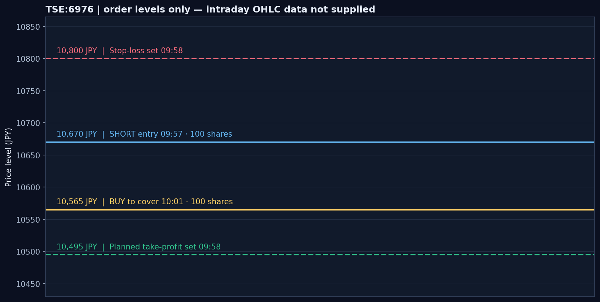
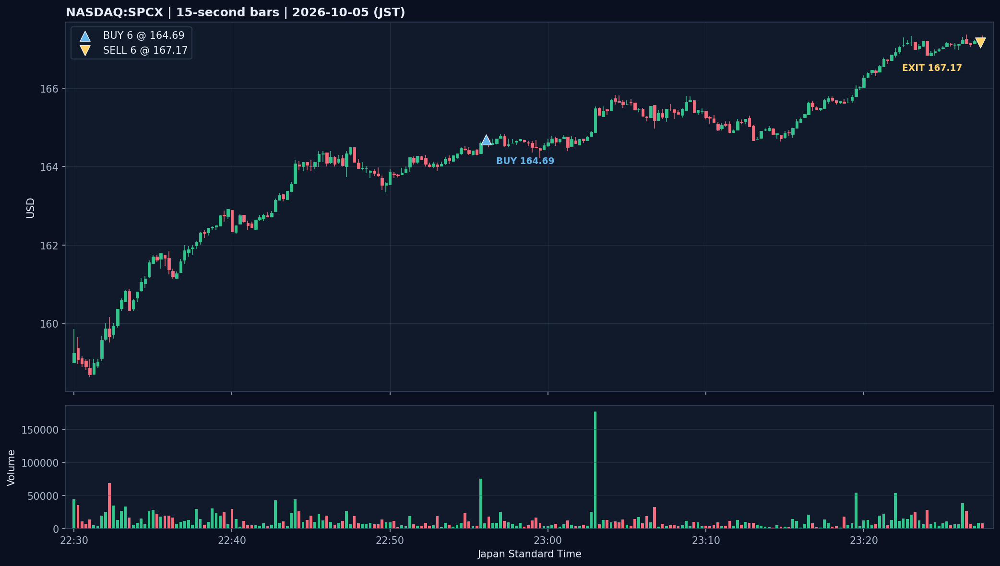
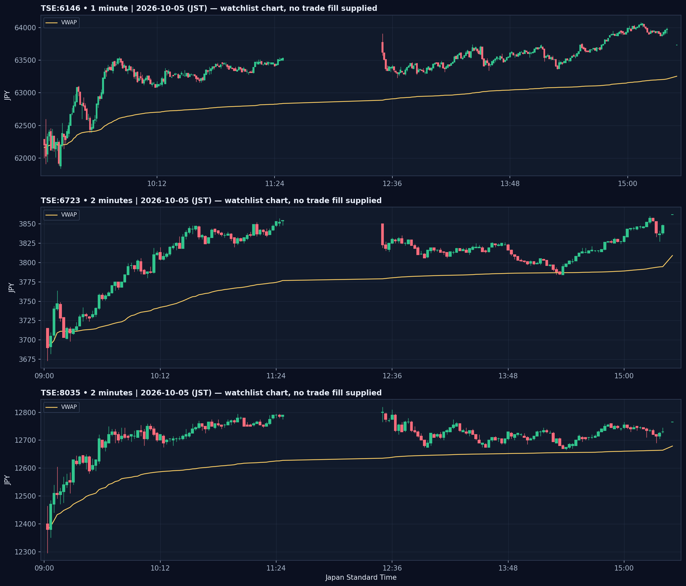
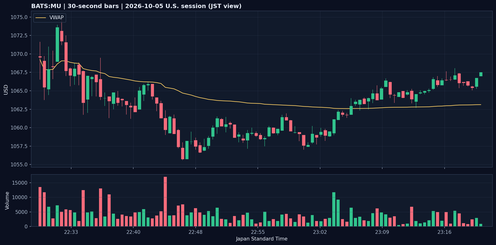

# 2026年10月5日（月）紙上取引日誌｜日本株・米国株

> **記録区分：TradingView Paper Trading（シミュレーション）**。実口座の約定ではない。約定価格・時刻・実現損益は、アップロードされた注文履歴、アクティビティログ、残高履歴を照合して記録した。時刻はJST。

## 0. 本日の結果

紙上取引の決済は2件。残高履歴の実現損益は合計 **＋12,853.6855円（約＋12,854円）**。

| 銘柄 | 方向 | 数量 | ENTRY → EXIT | 保有時間 | 実現損益（残高履歴） |
|---|---:|---:|---|---:|---:|
| 太陽誘電（TSE:6976） | SHORT | 100株 | 10,670円 → 10,565円 | 4分07秒 | **＋10,500円** |
| NASDAQ:SPCX | LONG | 6株 | $164.69 → $167.17 | 31分17秒 | **＋2,353.6855円**（$14.88相当） |
| **合計** |  |  |  |  | **＋12,853.6855円** |

手数料欄は空欄。ここではプラットフォーム残高履歴の実現損益を採用し、別途手数料を推計していない。

## 1. 約定照合・時系列

| JST | 銘柄 | 注文・ポジション | 記録 |
|---|---|---|---|
| 09:57:38 | 6976 | 100株 SHORT | 成行売り 10,670円。注文履歴とアクティビティに記録。 |
| 09:58:32 | 6976 | 利確注文 | 10,495円の指値買いを設定。 |
| 09:58:36 | 6976 | 損切り注文 | 10,800円の逆指値買いを設定。 |
| 10:01:45 | 6976 | SHORT決済 | 成行買い 10,565円。残高履歴に＋10,500円。利確・損切り注文は同時刻にキャンセル。 |
| 22:56:05 | SPCX | 6株 LONG | 成行買い $164.69。注文履歴とアクティビティに記録。 |
| 23:27:22 | SPCX | LONG決済 | 成行売り $167.17。残高履歴に＋2,353.6855円。 |

### 太陽誘電（6976）｜ショート

- 10,670円で100株売り、10,565円で買い戻し。価格差は105円、数量100株で **＋10,500円**。
- 注文設定上の損切りは10,800円、利確目標は10,495円。ENTRYからの想定損失幅は130円（13,000円）、目標利益幅は175円（17,500円）、設定時のリスクリワードは約 **1.35**。
- 実際の決済は利確目標より70円上。決済理由はログに記録されていないため、手動判断などと断定しない。
- 同日にもらった相場メモでは、10,500円付近の支持・Wボトム・VWAP上を根拠に短期買い目線としていた。一方、約定ログでは09:57にSHORTしている。相場メモの観察時刻やショート根拠を特定するチャートがないため、相場認識との整合性は要確認。
- 6976の当日ローソク足CSVは添付されていない。下図は注文価格の位置関係だけを示し、途中の値動きは表さない。

### NASDAQ:SPCX｜ロング

- 22:56:05に6株を$164.69で買い、23:27:22に$167.17で売却。保有31分17秒。
- 値幅は$2.48、取引損益は **+$14.88**。残高履歴の換算レート158.177792円/USDにより **＋2,353.6855円**。
- 4倍レバレッジ表示。取引理由はアップロードされた注文・活動記録に説明がないため、チャートだけから推測しない。
- 15秒足CSVは22:30〜23:27 JSTを含み、当日安値$158.62、高値$167.38、最終記録足の終値$167.22。約定価格の位置はチャートに印を付けた。

## 2. 添付チャートの相場環境（いずれも売買記録ではなく監視銘柄）

TSEのチャート時刻はJSTに変換した。始値欄は各CSVで確認できる当日最初の足であり、必ずしも市場の公式始値ではない。最後の価格もCSV最終足の値。

| 銘柄・足 | 当日最初の記録足 | 安値 | 高値 | CSV最終足 | 最終記録時VWAP |
|---|---:|---:|---:|---:|---:|
| 6146・1分 | 09:03 62,290円 | 61,840円（09:13） | 64,080円（15:08） | 15:30 63,730円 | 63,253.85円 |
| 6723・2分 | 09:02 3,715円 | 3,673円（09:02） | 3,862円（15:30） | 15:30 3,862円 | 3,809.03円 |
| 8035・2分 | 09:02 12,400円 | 12,295円（09:02） | 12,820円（12:30） | 15:30 12,765円 | 12,679.01円 |

- 6146・6723・8035の3銘柄はいずれも添付チャート上の最後の記録価格がVWAPを上回る。注文データにこれらの約定はないため、当日の売買成績には含めない。
- 8035の最終記録価格は当日高値より55円下。高値形成後の持ち合いを含む日足形状だが、CSVだけでは売買意図までは分からない。

### BATS:MU（Micron）・30秒足

- 添付範囲は10/5 22:30〜23:21 JST。最初の記録足は$1,069.68、安値$1,055.58（22:46）、高値$1,074.85（22:32）、最終記録価格$1,067.51。
- 最終記録時VWAPは$1,063.12。最終記録価格はVWAPより上。
- これは監視用チャートで、MUの注文・約定はアップロードされていない。CSVは23:21で終わり、その後の動きは含まない。

## 3. データ照合と留意点

- 注文履歴とアクティビティログは、6976の売り10,670円／買い10,565円、SPCXの買い$164.69／売り$167.17で一致。
- 残高履歴も6976の＋10,500円とSPCXの＋2,353.6855円を記録。合計＋12,853.6855円。
- SPCXの15秒足CSVは高値$167.38・最終足$167.22で約定価格付近を含む。一方、添付されたSPCX 1日足CSV2本は10/5の足が一致せず、一方は高値／終値$161.71、もう一方は高値$165.83・終値$165.74。いずれも15秒足と約定履歴の値を再現しないため、日足2本は約定検証に使わない。
- 6976のOHLC足、ポジション保有レポート、注文理由、相場実況の追加記録は今回の添付にない。該当する判断根拠は断定せず、未確認として残す。

## 4. 振り返り

1. **6976は事前に設定した無効化位置を確認する。** SHORT後に10,800円の損切りと10,495円の利確を設定しており、ルールは価格で定義できていた。利確目標を変更・取消したのか、10,565円で決済した理由は記録されていない。次回は決済時の判断を一文残す。
2. **6976の相場メモと実際のSHORTを同じ時刻軸で照合する。** メモの買い目線とSHORTは方向が異なる。エントリー時に支持を割ったのか、別の時間足で戻り売りを見たのか、チャート・根拠がないため未判定。
3. **SPCXはエントリー後に上昇し、15秒足CSV上では高値圏で決済している。** ただし理由の記録がなく、再現性を評価するにはエントリー根拠・損切り位置・利確条件の記録が必要。
4. 1日足スナップショットが食い違う場合は、今回のように注文履歴・残高履歴を損益の基準とし、15秒足／30秒足を時間軸の参考にする。

## 5. 添付チャート一覧

- [6976 注文水準図](assets/6976_order_levels_20261005.png) — OHLCチャートではない。
- [SPCX 15秒足・売買マーカー](assets/spcx_15s_trade_20261005.png)
- [TSE 6146・6723・8035 監視チャート](assets/tse_watchlist_20261005.png)
- [MU 30秒足・監視チャート](assets/mu_30s_context_20261005.png)
- [同日の相場メモ](market_memo_20261005.md)
