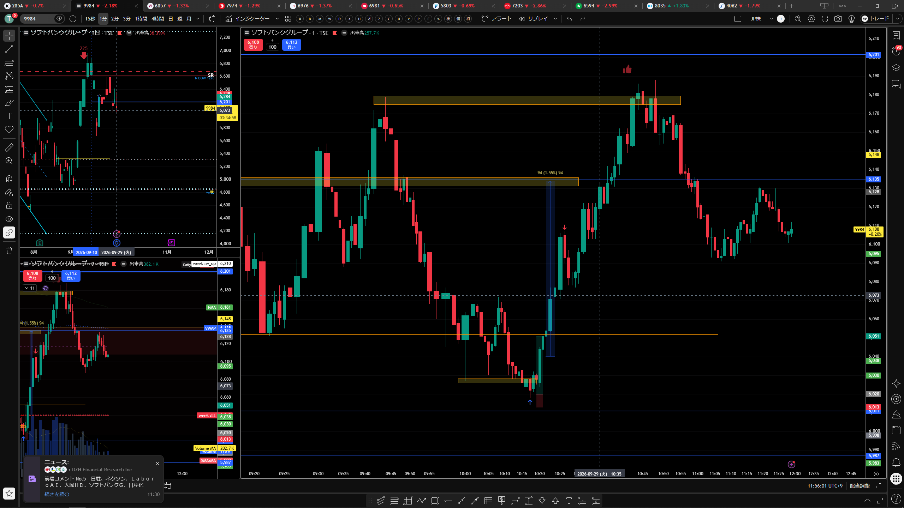
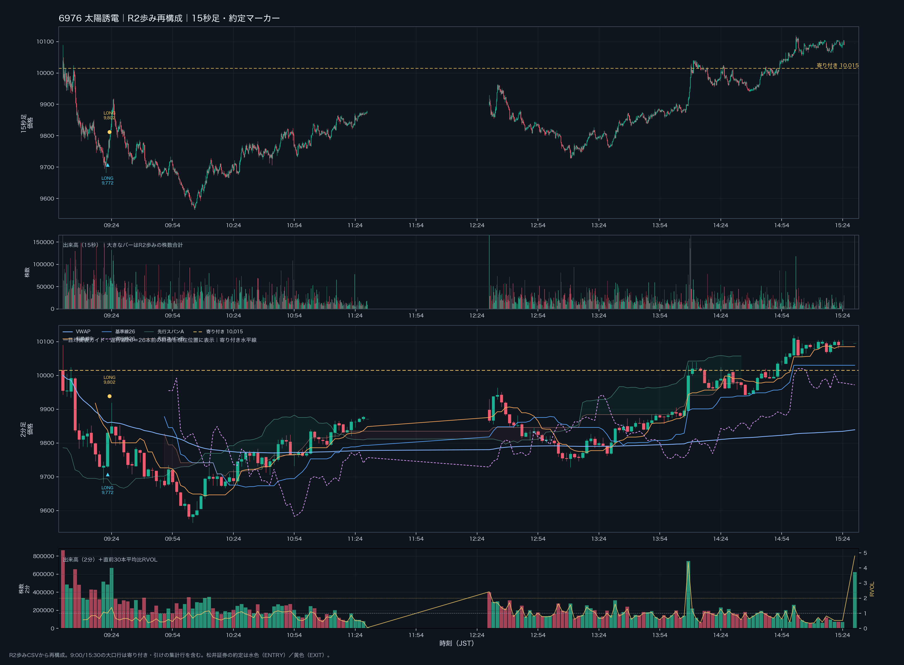
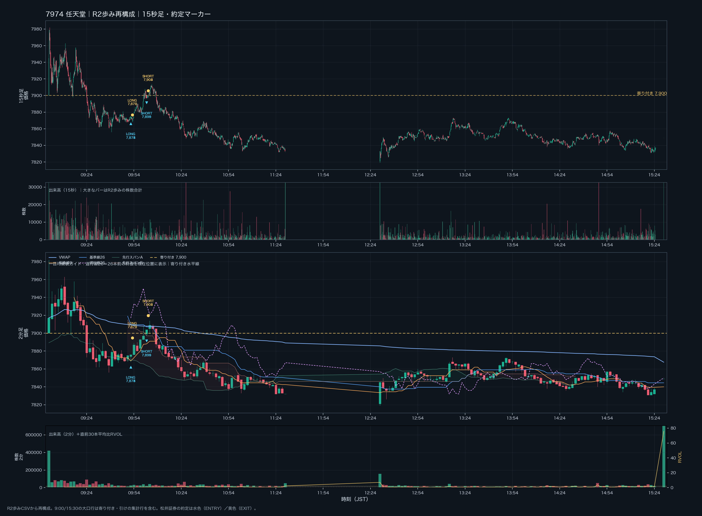
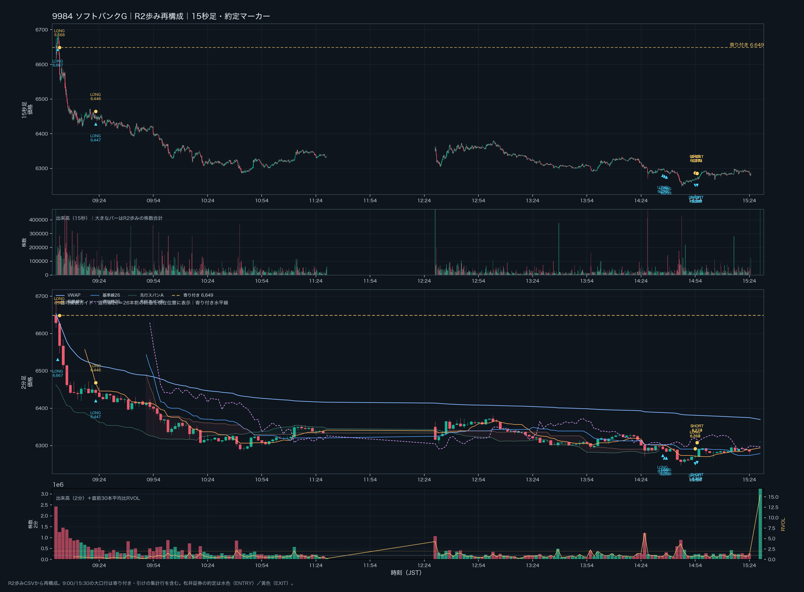

# トレードルール再確認｜勝ちやすい場面だけを選ぶ

> [スマートフォン向けHTML版](trading-rules.html)

更新日：2026-10-04

対象：日本株デイトレード

## 結論

「勝てるところ」とは、勝ちが確定している場所ではない。**相場の位置、個別銘柄の値動き、出来高への反応、損切り位置と利幅がそろい、同じ条件を繰り返し検証できる場面**を指す。勝率を保証する形ではなく、条件が足りなければ見送る。

## 最優先ルール

1. **9:00〜9:05は、原則として新規エントリーしない。** 寄り直後の値動きと売り買いの偏りを確認する。
2. この時間帯の例外は、**真空ゾーンのブレイクだけ**。板の空白・薄い価格帯が実際に抜け、値が走るポイントに限る。抜ける前の予想だけでは入らない。
3. 日経平均の方向や「今日はボラが大きい／小さい」という見立て**だけ**で個別銘柄に入らない。指数は環境認識、エントリーの根拠は個別銘柄でも確認する。
4. 条件が揃わなければノートレード。見送ることもルールの実行。

## エントリー候補になる条件

### 1. 位置に根拠がある

あらかじめ意識されているサポート・レジスタンス、レンジの上限／下限、前日高安、VWAP、出来高が集中した価格帯などで反応している。レンジの中央や、伸び切った位置への飛び乗りは避ける。

### 2. 個別銘柄で価格の反応を確認できる

大出来高が出たことだけでは入らない。大きな売買のあとに価格がさらに進まない（吸収・安値／高値更新の失敗）、ピンバーや切り返しが出る、次の足でも反応が続く、といった**売買の結果**を見る。

日誌に記録された候補の例：

- サポートを一度割った後、大出来高のピンバーで買い戻され、安値更新が止まる。
- ダブルボトム候補に加えて出来高の反応があり、切り下げラインを上抜く。
- 買われていたサポートが崩れ、下抜け後も価格がその下で推移する。
- トレンド方向への押し目で、直近安値／高値を更新せず、再度トレンド方向へ動く。

形の名前や切り番へのタッチだけで判断しない。**位置＋価格反応＋次の値動き**をセットで見る。

### 3. 指数と個別を別々に確認する

日経平均では上位足の方向と、現在のレンジの上限・下限・中央を確認する。次に、個別銘柄のサポレジ、短期の高値・安値、板・歩み値、出来高と価格の反応を確認する。指数が上でも個別が下がることがあるため、指数の上方向だけで個別ロングを正当化しない。

シンクロ銘柄や関連銘柄の方向は補助材料にする。指数・関連銘柄と個別の動きが食い違うときは、個別側の根拠がはっきりするまで待つ。

### 4. 損失を限定でき、利幅が残っている

エントリー前に、シナリオが崩れる無効化ライン、許容損失、利確候補を決める。次のサポレジ、VWAP、直近高安などまでの値幅に対し、損切り幅が大きすぎるなら入らない。すでに動いた後の追いかけや、損切り位置を決められない取引は見送る。

最初のポジションと相場の反応を確認する前に、複数銘柄へ同時にポジションを増やさない。乗り換え先も、独立したエントリー根拠を最初から確認する。

## 見送る条件

- 9:00〜9:05で、真空ゾーンの実際のブレイクではない。
- 根拠が「日経平均が上／下」「ボラが高い／低い」「出来高が大きい」だけ。
- 節目やピンバーに触れただけで、価格が反応したか確認できていない。
- レンジ中央、またはロングでレンジ上端など、利幅が残っていない位置。
- ブレイク前の先回り、または伸びた後の飛び乗り。
- 損切り位置・許容損失・利確候補を事前に説明できない。
- 指数と個別の不一致を把握しているのに、個別の確認材料がない。

## 発注直前のチェック

- [ ] 時刻を確認した。9:00〜9:05なら真空ゾーンの実ブレイクに限っている。
- [ ] 日経平均の上位足の方向と、レンジ内の位置を説明できる。
- [ ] 個別銘柄の重要価格帯と、そこで起きた価格反応を説明できる。
- [ ] 大出来高だけでなく、その後に価格が進んだか／止まったか、次の足が続いたかを見た。
- [ ] エントリーの引き金（ブレイク、リテスト、切り返し等）がすでに起きた。
- [ ] 無効化ライン、許容損失、利確候補を決めた。リスクリワードが悪ければ見送る。
- [ ] 既存ポジションを増やす前に、現在のポジションと相場の反応を確認した。

**ひとつでも説明できない項目があれば、入らずに待つ。**

## 日誌から読み取れる参考例

### 9/29 ソフトバンクG｜売りの後の買い戻し

大きな売りの後に買い戻しのピンバーが出てロング。記録上は6,038円から6,100円まで上昇した。出来高の大きさだけでなく、売りの後に買われた反応を見た例。利確を早めた点は別の改善課題。

### 10/2 太陽誘電｜下抜け後の買い戻し

9,700円付近を一度下抜けた後、大出来高の買い戻しピンバーが出た場面をロング候補として振り返った。約定価格に記録上の不整合があるため、画像は値動きの形を確認する補助とし、正確な約定位置を示すものとは扱わない。

### 10/2 任天堂｜複数の反応が重なったロング候補

ダブルボトム候補、大出来高の下げ止まり、切り下げライン上抜けをロング候補として振り返った。振り返り上の候補・試算を確定損益と混同しない。

### 10/2 ソフトバンクG｜レンジ上部への飛び乗りを避ける

レンジと認識できる中で上昇に飛び乗り、損切りが遅れた。指数の上向きより、レンジの位置と個別のエントリー位置を優先すべき反例。

これらは少数の日誌に基づく振り返りで、統計的に勝率が証明された売買法ではない。今後、似た形の勝ち・負け・見送りを同じ基準で記録し、再現性を確かめる。

## 日誌・週報

- [9/29 トレード記録](2026-09-29_daytrading_log.md) / [振り返り](2026-09-29_trade_review.md)
- [9/30 トレード記録](2026-09-30_daytrading_log.md)
- [10/1 トレード記録](2026-10-01_daytrading_log.md)
- [10/2 トレード記録](2026-10-02/2026-10-02_daytrading_log.md) / [日誌HTML](diaries/2026-10-02/diary_20261002.html)
- [9/28〜10/2 週報](weekly_reports/weekly_report_2026-W40_20260928-20261002.md)
